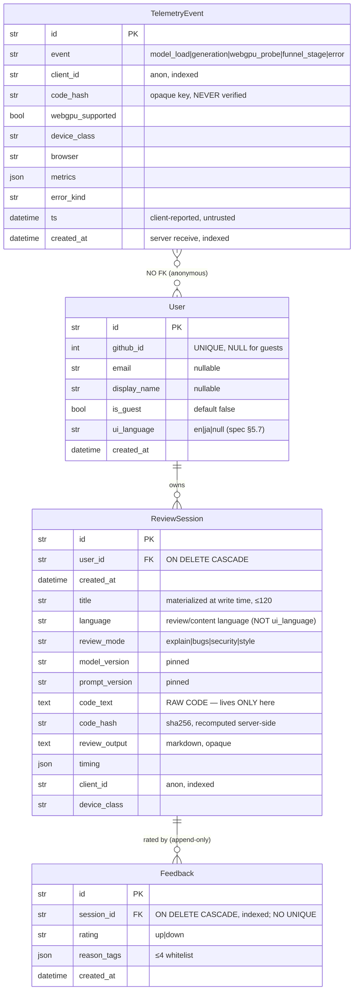

# Backend Architecture — Code Review Web App

**Date:** 2026-06-08
**Status:** design-complete — canonical backend architecture (DigitalOcean / Singapore).
**Spec (source of truth):** [`../specs/2026-06-08-code-review-app-design.md`](../specs/2026-06-08-code-review-app-design.md)
(cited as `spec §N`).
**Companion docs:** `api-contract.md` (the standalone FE↔BE contract — this doc **consumes** it, never restates it),
`frontend.md` (the SPA / in-browser inference), `deploy-digitalocean.md` (the full ops runbook + the AWS↔DO product
mapping), and `README.md`.

> **What this backend is.** A *thin, stateful* FastAPI service behind Caddy that does exactly three things:
> **auth/identity**, **history persistence** (reviews + feedback), and **telemetry ingestion**. It is deliberately
> **not** on the critical inference path — Qwen2.5-Coder-1.5B runs entirely in the browser (WebLLM → WebGPU; spec §2 /
> §3). The backend never holds an LLM key, never runs a model, and exposes **no inference or streaming endpoint**.
> The browser runs a review to completion locally, then **POSTs the finished result** to be persisted.
>
> **Why this thinness is the point (spec §1).** Because inference is client-side, the server has **no GPU bill** and
> scales with cheap auth/DB/telemetry traffic, not with usage. There is **no model credential to leak** — there is no
> model key on the server at all.

> **Cross-reference convention:** bare `§N` references are sections of **this** document; spec sections are written
> explicitly as **`spec §N`**; the standalone contract is **`api-contract.md §N`**.

> **Acronyms (first-use glossary):** **TTFT** = time-to-first-token · **WebGPU** = the browser GPU-compute API WebLLM
> runs on · **IDOR** = Insecure Direct Object Reference (reaching another user's row by guessing its id) · **OODA** =
> Observe-Orient-Decide-Act (the spec's product feedback loop) · **APPI** = Japan's Act on the Protection of Personal
> Information (≈ GDPR) · **RED** = Rate/Errors/Duration (service-metrics method) · **`doctl`** = DigitalOcean's CLI
> (used here to cron DigitalOcean Volume Snapshots, §7.3).

### Executive summary (for the enterprise-customer reader)

This design targets large-enterprise customers as well as engineering teammates (spec §11). In plain terms:

- **Thin, stateful service — never runs the model.** The model runs entirely in the end user's browser (WebLLM/
  WebGPU). The backend only stores history, feedback, and telemetry. Consequence: **zero server-side inference cost**
  and **no LLM API credential to leak** — there is no model key on the server at all.
- **Data-handling posture.** Every user's data is isolated and owner-scoped; raw reviewed code is confined to one
  database column and is **never written to logs, telemetry, or error responses**. Encryption-at-rest is in force (the
  DigitalOcean Block Storage Volume is encrypted at rest by default); users get per-item delete and a telemetry
  opt-out. The design is built with APPI (Japan) / GDPR awareness (§10.5).
- **Reliability posture.** The demo runs as a single always-on instance (a documented single point of failure, §7.5)
  with a concrete, no-rewrite production path to high availability (managed PostgreSQL — DigitalOcean Managed
  Databases, or RDS Multi-AZ on AWS — plus multiple stateless instances behind a load balancer, §7.4).

Engineering details (SQLite pragmas, ASGI middleware ordering, OAuth handling) follow below.

---

## Table of contents

1. [Overview & responsibilities](#1-overview--responsibilities)
2. [Tech stack & choices](#2-tech-stack--choices)
3. [Layered architecture & package layout](#3-layered-architecture--package-layout)
4. [Request lifecycle & middleware](#4-request-lifecycle--middleware)
5. [Data model & migrations](#5-data-model--migrations)
6. [Auth & session model](#6-auth--session-model)
7. [Persistence & robustness (SQLite specifics)](#7-persistence--robustness-sqlite-specifics)
8. [Endpoints I expose / consume (→ api-contract.md)](#8-endpoints-i-expose--consume--api-contractmd)
9. [Why there is no streaming endpoint (and where SSE would live)](#9-why-there-is-no-streaming-endpoint-and-where-sse-would-live)
10. [Security](#10-security)
11. [Observability & operations](#11-observability--operations)
12. [Deploy & runtime](#12-deploy--runtime)
13. [Testing](#13-testing)
14. [Mandatory-requirements coverage](#14-mandatory-requirements-coverage)
15. [Canonical contract — pointer + OpenAPI generation](#15-canonical-contract--pointer--openapi-generation)
16. [Open questions](#16-open-questions)

---

## 1. Overview & responsibilities

The product is **browser-first** (spec §1, §2): Qwen2.5-Coder-1.5B is downloaded once and runs on the user's own device
via WebLLM/WebGPU. The server's *only* job is to be the **system of record for state and signals** — not a compute
path. The model runs **before** the backend is ever touched.

### 1.1 In scope (the backend owns these)

| Responsibility | What it means | Spec |
|---|---|---|
| **Authentication** | GitHub OAuth (primary) **plus** a guest/demo mode (no OAuth, isolated history). Issues and verifies the signed session cookie. | spec §5.1, §5.2, §9 |
| **History persistence** | Stores each `ReviewSession` (code, output, mode, versions, timing) and serves per-user history CRUD for the History UI (restore / list / delete; empty + save-failed states). | spec §5.1, §7 |
| **Feedback** | Stores 👍/👎 + reason tags against a session — the gold eval signal. **Append-only.** | spec §5.4, §6.2 |
| **Telemetry ingestion** | Accepts *beaconed* client telemetry (model-load success/failure, load time, TTFT, tok/s, WebGPU-support, device/browser mix, feedback ratio). **Metadata + `code_hash` only — never raw code.** | spec §6.1, §6.4 |
| **Secret management** | Holds the OAuth client secret, DB path, and session signing key (the reframed "API key management" — **there is no LLM key**). | spec §2, §9 |
| **Error handling** | Backend 4xx/5xx, DB, and auth errors returned as a uniform RFC 9457 `problem+json` shape. (WebGPU/load/generation errors are the *client's* job.) | spec §6.1 |

### 1.2 Explicitly NOT in scope (hard boundary)

- **No LLM inference.** There is no `/api/generate`, no model proxy, no streaming endpoint, no LLM API key on the
  server. The "LLM API" requirement is satisfied by the in-browser `engine.chat.completions.create(...)`
  call (spec §2). A no-WebGPU visitor **cannot** run a review against the backend; the backend must not be assumed
  to provide a fallback. The dead-end is mitigated at the **demo layer** (guest mode + seeded sample code), not here
  (spec §5.2; §9, §16).
- **No server-side "warm-start" inference.** Designed-but-not-built (spec §12); the one place an SSE route *would*
  live is documented in §9 so the omission reads as a decision.
- **No rate-limit enforcement** for the demo — scaffolded as a no-op only (spec §10; §10.4 below).
- **No multi-model selection** (spec §6.3).

### 1.3 Request lifecycle (where the backend sits)

```
Browser (WebLLM/WebGPU runs the model locally)
   │  user runs a review entirely on-device → gets {review_output, timing}
   │
   ├─(1) POST /api/reviews        → persist the completed review (code + output + versions + timing)
   ├─(2) POST /api/feedback       → 👍/👎 on a stored session (append-only, latest-wins)
   ├─(3) POST /api/telemetry      → beacon load/perf/capability metrics (code_hash only; auth='none')
   └─(4) GET  /api/reviews, /{id} → render History UI / restore a prior review
                │
        Caddy (same origin, TLS) ──/api──▶ uvicorn (1 process, no --workers) ──▶ FastAPI
                                                   ──▶ services ──▶ repositories ──▶ SQLAlchemy(sync) ──▶ SQLite (WAL, DO Block Storage Volume)
```

The backend is a thin, stateful CRUD + ingest service. Inference is upstream, in the browser, always.

---

## 2. Tech stack & choices

All choices are concrete and version-pinned. Pins are the latest stable lines as of 2026-06; the lockfile
(`uv.lock` / `requirements.txt`) is the binding artifact.

| Concern | Choice | Version (pin line) | Rationale | Spec |
|---|---|---|---|---|
| Language / runtime | **Python** | 3.12.x | Hard mandate in both briefs. 3.12 for typing + perf **and** for the `sqlite3.autocommit` / `LEGACY_TRANSACTION_CONTROL` behavior the pragma listener depends on (§7.2). | spec §2 |
| Web framework | **FastAPI** | `0.115.x` | Named in spec §9. Async, Pydantic-native, OpenAPI for free → the live `/api/openapi.json` *must* match `api-contract.md` (§15). | spec §2, §9 |
| ASGI server | **uvicorn** under **systemd** | `0.34.x` | Auto-restart, start-on-boot. **Single process, no `--workers` flag, no gunicorn pre-fork** — see §2.1. | spec §9 |
| ORM | **SQLAlchemy 2.0** (typed, `Mapped[...]`) | `2.0.x` | Typed models; gives the documented Postgres migration path (§7.4) for free. Repository layer keeps the ORM behind one boundary. | spec §7, §9 |
| Migrations | **Alembic** | `1.13.x` | `render_as_batch=True` for SQLite `ALTER` support; same migrations run on Postgres later (§5.6). | spec §7 |
| Validation / settings | **Pydantic v2** + **pydantic-settings** | `2.x` | Request DTOs with `extra='forbid'`; env-driven typed config. | spec §8 |
| OAuth | **Authlib** (Starlette integration) + **httpx** | `1.3.x` | GitHub OAuth2 authorization-code flow (confidential client + secret) with signed-`state` CSRF. Avoids hand-rolling the handshake (§6.2). | spec §5.1 |
| Session transport | **Starlette `SessionMiddleware`** (signed, `HttpOnly` cookie via `itsdangerous`) | bundled | **Signed cookie, not JWT** — §2.2. Reuses the cookie Authlib already requires → one signing key, genuinely stateless. | spec §6 |
| DB engine | **SQLite (WAL)** on a **DigitalOcean Block Storage Volume** (block-level, ext4) | stdlib `sqlite3` | The requirements call for a real DB from {SQLite/Postgres/MySQL/Redis} and **do not** accept localStorage → a real DB is mandatory. Robust under single-writer + real-block-volume + WAL + backups (§7). | spec §5.1, §9 |
| Driver | **pysqlite (stdlib, sync)** | stdlib | Sync engine chosen over `aiosqlite` — §2.1. | spec §7 |
| Logging | **structlog** + `contextvars` | `24.x` | Structured JSON, per-request correlation id (§11.1). | spec §6.1 |
| Correlation id | **pure-ASGI** middleware (`asgi-correlation-id` or hand-rolled) | `4.x` | **Not** `BaseHTTPMiddleware` — the contextvar isolation footgun (§4.2, §11.2). | spec §6.1 |
| Rate-limit scaffold | **SlowAPI** wired as a no-op (pure-ASGI passthrough) | `0.1.x` | Present, `enabled=False`, one-line switch. ASGI variant, not `BaseHTTPMiddleware`. | spec §10 |
| Lint / format | **ruff** + **black** | latest | The requirements mandate a linter/formatter; spec names these. | spec §8 |
| Reverse proxy / TLS | **Caddy** | `2.x` | Auto Let's Encrypt, serves the SPA, proxies `/api`. Same origin → no CORS. | spec §9 |

No `sse-starlette` in the demo dependency set — it appears only in the *designed-not-built* warm-start note (§9). No
LLM/AI dependency of any kind (spec §2).

### 2.1 Concurrency model — single process, sync engine (load-bearing)

**Decision:** run **exactly one** uvicorn OS process (no `--workers` flag, no gunicorn pre-fork) using a
**synchronous** SQLAlchemy engine; concurrency comes from Starlette's threadpool (`run_in_threadpool` for sync route
handlers / DB calls).

- **Why single process.** SQLite is single-writer. WAL permits *many readers + one writer within one process*. The
  moment a second process (or instance) contends the same WAL file you get `database is locked` / `SQLITE_BUSY` and a
  corruption risk (spec §9). One process owning the file is the **load-bearing correctness guarantee**, and
  multi-worker/multi-instance is the **explicit trigger to migrate to Postgres** (§7.4). A multi-worker leak surfaces
  to the user as intermittent `5xx` → the SPA's `SAVE_FAILED` state.
- **Why sync over async/`aiosqlite`.** `aiosqlite` is a thread-pool wrapper, not true non-blocking I/O — each
  connection runs on a background thread anyway. For a single-process auth/history demo, a plain sync engine +
  Starlette threadpool is equally capable and simpler (no async event-listener attachment quirks, no async pragma
  plumbing). If a route is declared `async def`, it **must not** make blocking DB calls directly; DB handlers stay
  sync and FastAPI offloads them. The one route that genuinely mixes both worlds (the OAuth callback) is resolved
  explicitly in §6.2.
- `busy_timeout=5000` absorbs the rare in-process write contention by retrying instead of erroring — but ONLY
  because transactions `BEGIN IMMEDIATE` (§7.2). Under a deferred `BEGIN`, a read-then-write transaction whose
  snapshot went stale fails instantly with `SQLITE_BUSY_SNAPSHOT` and busy_timeout never applies (prod 503,
  2026-06-11).

### 2.2 Session: signed cookie, not JWT (decision + justification)

The spec's open item proposed "a signed-token cookie (itsdangerous/JWT-style)." **Resolved to a signed (HMAC) cookie
via Starlette `SessionMiddleware`, not a JWT.** For a single-origin single-service demo:

1. **Authlib already mandates `SessionMiddleware`** for the OAuth handshake (it stores the OAuth `state`/CSRF nonce
   there). Reusing that same signed cookie for post-login state means **one** cookie, **one** signing key, and no
   second stateful surface alongside SQLite — exactly the "stay genuinely stateless" rationale in the spec.
2. **What matters is storage/transport, not encoding.** An `HttpOnly` cookie is invisible to JS → XSS-exfiltration
   resistant in a way a `localStorage`-held JWT is not.
3. **Revocation is trivial** — rotate the signing key; no JWT blocklist, no "logout is hard" workaround.
4. JWT's only real edge (cross-service statelessness) is irrelevant here.

The `SessionMiddleware` `secret_key` **is** the "session signing key" from the reframed secret-management plan (§2,
§10.3). **Do not run two competing session mechanisms** (a custom JWT cookie *and* the Authlib cookie) — that is a
known footgun (two keys, ambiguous auth state).

---

## 3. Layered architecture & package layout

A strict layered flow keeps each unit small and independently testable without HTTP. Routers stay thin; logic lives
in services; only repositories touch the ORM:

```
HTTP ─▶ routers/ ─▶ services/ ─▶ repositories/ ─▶ models/ (SQLAlchemy 2.0) ─▶ SQLite
            │            │              │
        Pydantic      business      the ONLY layer
        schemas       logic +       that imports ORM
        (no logic)    OWNERSHIP     models / issues
                      scoping       queries (mockable)
```

- **`routers/`** — thin HTTP adapters: parse/validate via Pydantic, call a service, shape the response. No business
  logic, no DB access.
- **`services/`** — business logic and the place **ownership scoping** is enforced (a service refuses to return
  another principal's review; §6.4). Orchestrate repositories. The async/sync boundary (§6.2) is resolved here.
- **`repositories/`** — the only code that imports ORM models / issues queries. Swappable, mockable; the seam that
  makes the SQLite→Postgres swap (§7.4) a configuration change rather than a rewrite.
- **`models/` (ORM) vs `schemas/` (Pydantic DTOs)** — persistence shape vs the wire shape from `api-contract.md`,
  kept separate so storage schema and API can evolve independently.

### 3.1 Directory structure

```
backend/
├── pyproject.toml              # deps, ruff + black config
├── alembic.ini
├── migrations/                 # Alembic
│   ├── env.py                  # render_as_batch=True; MetaData naming_convention (§5.6)
│   └── versions/
│       └── 0001_initial.py     # creates user, review_session, feedback, telemetry_event (§5)
├── app/
│   ├── main.py                 # app factory: middleware wiring, router include, exception handlers, lifespan
│   ├── core/
│   │   ├── config.py           # pydantic-settings (Settings) from env (§10.3)
│   │   ├── security.py         # session signing, OAuth state/CSRF, current_principal dependency (§6)
│   │   ├── logging.py          # structlog config (JSON renderer, merge_contextvars)
│   │   └── errors.py           # RFC 9457 problem+json helpers + exception handlers (api-contract.md §4)
│   ├── db/
│   │   ├── engine.py           # create_engine + WAL/FK/busy_timeout pragma listeners (§7.2)
│   │   ├── session.py          # SessionLocal + get_db dependency
│   │   └── models.py           # SQLAlchemy 2.0 models: User, ReviewSession, Feedback, TelemetryEvent (§5)
│   ├── schemas/                # Pydantic v2 DTOs (request/response), extra='forbid'
│   │   ├── auth.py             # MeResponse, ProfileUpdate
│   │   ├── reviews.py          # ReviewCreate, ReviewListItem, ReviewListPage, ReviewDetail, Timing
│   │   ├── feedback.py         # FeedbackCreate, FeedbackResponse
│   │   └── telemetry.py        # TelemetryBeacon
│   ├── routers/                # health.py, auth.py, reviews.py, feedback.py, telemetry.py
│   ├── services/
│   │   ├── auth_service.py     # GitHub profile fetch, user upsert, guest creation, guest→user re-parent
│   │   ├── review_service.py   # get_owned helper (IDOR-safe; §6.4), create/list/delete, title materialization
│   │   ├── feedback_service.py # append-only write, "current" = MAX(created_at) tie-break MAX(id)
│   │   └── telemetry_service.py# payload validation + persist (raw-code drop, §10.6)
│   ├── repositories/           # user_repo.py, review_repo.py, feedback_repo.py, telemetry_repo.py
│   └── middleware/
│       ├── request_id.py       # PURE ASGI correlation-id middleware (§4.2, §11.2)
│       ├── body_limit.py       # PURE ASGI hard request-body byte cap (§10.2)
│       └── rate_limit.py       # no-op scaffold (SlowAPI/ASGI), enabled=False (§10.4)
└── tests/
    ├── test_auth.py
    ├── test_reviews_scoping.py # cross-user 404, guest isolation
    ├── test_validation.py      # size caps, extra='forbid', enums, code_hash recompute
    ├── test_telemetry.py       # raw-code rejection, auth='none', 8 KB cap
    └── conftest.py             # in-memory/temp-file SQLite fixtures (WAL)
```

**App-factory wiring order in `main.py`** (order matters — see §4):

1. `SessionMiddleware` (signed cookie — Authlib needs it + carries our session).
2. Pure-ASGI `request_id` middleware (correlation id bound to contextvars *before* logging runs).
3. Pure-ASGI `body_limit` middleware (reject oversized bodies *before* they reach Pydantic — §10.2).
4. Pure-ASGI `rate_limit` scaffold (no-op).
5. Routers under `/api`.
6. Exception handlers (`HTTPException`, `RequestValidationError`, `SQLAlchemyError`, bare `Exception` → problem+json).
7. `lifespan`: nothing heavy (no LLM). The DB engine is module-level; Alembic runs in `ExecStartPre`, not here.

---

## 4. Request lifecycle & middleware

Auth is resolved per-route by a **`current_principal`** dependency (`core/security.py`): it reads/verifies the signed
session cookie and returns a `user` or `guest` principal, or raises `401`. Routes that mutate/read history depend on
it; `services/` then enforce ownership (§6.4). `POST /api/telemetry` does **not** depend on it (`auth='none'`, §8).

### 4.1 Middleware stack (outermost → innermost)

| Order | Middleware | Job | Notes |
|---|---|---|---|
| 1 | **SessionMiddleware** | Decode/verify the signed cookie | Authlib also stores OAuth `state` here (§6.2). |
| 2 | **request_id (pure ASGI)** | Generate/propagate a correlation id (ULID; honor inbound `X-Request-ID`); `bind_contextvars` | Echoed on responses and in the problem+json body. |
| 3 | **body_limit (pure ASGI)** | Hard request-body byte cap *below* Pydantic | Closes the OOM gap (§10.2); per-route 8 KB on telemetry. |
| 4 | **rate_limit (pure ASGI)** | No-op scaffold | `enabled=False`; one-line switch (§10.4). |
| — | **Exception handlers** | Map domain/validation/DB errors → `api-contract.md §4` envelope | Never leak SQL / paths / stack traces. |

### 4.2 The `BaseHTTPMiddleware` contextvar footgun (why all three are pure ASGI)

The correlation-id, body-limit, and rate-limit middleware are **pure ASGI**, never `BaseHTTPMiddleware` /
`@app.middleware("http")`. `BaseHTTPMiddleware` runs the endpoint in a **separate task** whose contextvar copy is
**not** visible in the middleware's `finally`, so a correlation id bound there leaks/mismatches across concurrent
requests and corrupts the per-session id. Pure ASGI also future-proofs against Starlette's planned
`BaseHTTPMiddleware` deprecation, and it is lower-overhead with proper async exception handling.

---

## 5. Data model & migrations

Four tables: the spec §7 (draft) model plus four documented, deliberate extensions — `User.is_guest`,
`User.ui_language`, `ReviewSession.title`, and the `TelemetryEvent` sink — each justified inline. SQLAlchemy 2.0
typed models. **All FKs are enforced** (`PRAGMA foreign_keys=ON`, §7.2). Every `ReviewSession` pins `model_version`
and `prompt_version` (required for the OODA loop / A-B analysis — spec §5.1, §6.2).



### 5.1 `User`

| Column | Type | Constraints | Notes |
|---|---|---|---|
| `id` | `str` (UUID) | PK | App-generated UUID4 string (portable to Postgres). |
| `github_id` | `int` | UNIQUE, nullable | GitHub numeric id. **NULL for guests.** |
| `email` | `str(320)` | nullable | From `/user/emails` primary verified; may be null. |
| `display_name` | `str(255)` | nullable | GitHub login or `"Guest"`. |
| `is_guest` | `bool` | NOT NULL, default `False` | Guest identities (spec §5.2 isolation). **Spec §7 extension.** |
| `ui_language` | `str(8)` | nullable | Persisted UI-locale toggle: `en` \| `ja` (spec §5.7). Null = "not yet chosen". **Per-user UI language — distinct from `ReviewSession.language` (review-content language).** **Spec §7 extension.** |
| `created_at` | `datetime` (UTC) | NOT NULL, default now | |

> **Spec §7 traceability.** The *draft* spec §7 `User` lists only `id, github_id, email, display_name, created_at`.
> We extend it with **`is_guest`** (the locked guest-mode + isolated-history decision, spec §5.2/§9; guests carry
> `github_id=NULL`) and **`ui_language`** (spec §5.7's locked "persisted to localStorage **and** the user profile" —
> the *profile* half is server-side state so a signed-in user's UI language survives a device switch). Documented so
> the divergence is intentional, not silent.

Index: unique on `github_id`. On SQLite, multiple NULLs are treated as distinct (exactly what we want for guests); on
Postgres a partial unique `WHERE github_id IS NOT NULL` is the equivalent.

### 5.2 `ReviewSession`

| Column | Type | Constraints | Notes |
|---|---|---|---|
| `id` | `str` (UUID) | PK | Equals `api-contract.md` `ReviewDetail.id` and `Feedback.session_id`. |
| `user_id` | `str` | **FK → user.id**, NOT NULL, ON DELETE CASCADE | **Owner.** Every history query filters on this (§6.4). |
| `created_at` | `datetime` (UTC) | NOT NULL, default now | List ordering + cursor pagination; covered by the composite index. |
| `title` | `str(120)` | NOT NULL | **Detail title, materialized at write time** — `filename` if supplied, else the first non-blank line of `code_text` (verbatim), truncated 120 (§5.5 below). Read by `ReviewDetail`, NOT by the list path. |
| `list_header` | `str(48)` | NOT NULL | **Sidebar label, materialized at write time** — first `def`/`class` name, else first non-blank line, with editor line-numbers stripped, ≤48 (§5.5). The `ReviewListItem.title` field. Distinct derivation from `title` (the symbol, not the filename). |
| `snippet` | `str(80)` | NOT NULL | **Sidebar secondary line, materialized at write time** — cleaned first code line, ≤80 (§5.5). |
| `code_bytes` | `Integer` | NOT NULL | **UTF-8 byte length of `code_text`, materialized at write time** — sidebar size affordance; avoids re-reading `code_text` (§5.5). |
| `line_count` | `Integer` | NOT NULL | **Line count of `code_text`, materialized at write time** — sidebar length affordance (§5.5). |
| `language` | `str(32)` | nullable | **Review/content language** (e.g. `python`, or `ja`/`en` review-output language; spec §7). **Distinct from `User.ui_language`.** |
| `review_mode` | `str(16)` enum | NOT NULL | `explain` \| `bugs` \| `security` \| `style` (spec §5.5). |
| `model_version` | `str(64)` | NOT NULL | e.g. `Qwen2.5-Coder-1.5B@<rev>`. **Pinned per record.** |
| `prompt_version` | `str(64)` | NOT NULL | e.g. `review-v3`. **Pinned per record.** |
| `code_text` | `Text` | NOT NULL | Raw code. **Lives ONLY here**, never in logs/telemetry (§10.6). ≤256 KB (§10.2). |
| `code_hash` | `str(64)` | NOT NULL | SHA-256 hex; **recomputed server-side** on create (`api-contract.md §6.2`). |
| `review_output` | `Text` | NOT NULL | The model's markdown; stored opaque, sanitized **client-side** on render (§10.7). |
| `timing` | `JSON` | nullable | `{load_ms, ttft_ms, total_ms, tokens_prompt, tokens_completion, tok_per_sec}` (spec §5.3/§7). |
| `client_id` | `str(36)` | nullable, indexed | Anonymous UUID stitching sessions (spec §6.4). |
| `device_class` | `str(128)` | nullable | Coarse GPU/mem/browser (spec §6.4). No fingerprinting. |

**Composite index `ix_review_user_created (user_id, created_at DESC)`** — the *only* index beyond the PK; it is the
hot path for the History UI list and the keyset cursor `(created_at, id) < (?, ?) ORDER BY created_at DESC`. **No**
separate single-column indexes on `user_id`/`created_at` (the composite covers them; redundant indexes are pure
write-amplification). The `client_id` index is independent (session stitching).

### 5.3 `Feedback` — append-only, latest-wins

| Column | Type | Constraints | Notes |
|---|---|---|---|
| `id` | `str` (UUID) | PK | |
| `session_id` | `str` | **FK → review_session.id**, NOT NULL, ON DELETE CASCADE, **indexed** | **Append-only, many-per-session.** **No `UNIQUE(session_id)`.** |
| `rating` | `str(4)` enum | NOT NULL | `up` \| `down`. |
| `reason_tags` | `JSON` (list[str]) | nullable | Whitelist `inaccurate` \| `too_vague` \| `wrong_language` \| `hallucinated`; ≤4 distinct (spec §5.4). |
| `created_at` | `datetime` (UTC) | NOT NULL, default now | Used to compute "current" feedback. |

> **Cardinality (RESOLVED — append-only).** Feedback is **append-only and many-per-session**. A re-vote (👍→👎, or
> edited tags) **inserts a new row**; nothing is updated or rejected — the server **never returns `409`**
> (`api-contract.md §6.4`). This preserves the full rating-change history as eval signal. The **"current"** feedback
> embedded in `ReviewDetail.feedback` is the row with **`MAX(created_at)`, tie-broken by `MAX(id)`**; `null` if never
> rated. *(Resolves the source drafts' upsert-vs-append divergence in favor of append-only; replaces the spec's
> Feedback-cardinality open question.)*

> **Ownership.** `Feedback` has no `user_id`; ownership is derived through `session_id → review_session.user_id`. The
> feedback create path verifies the target session belongs to `current_principal` (§6.4) before inserting, else `404`.
> Note `session_id` is the **persistence FK name** — it equals the wire `ReviewDetail.id` and is **unrelated** to the
> auth-session cookie (`api-contract.md §6.4`).

### 5.4 `TelemetryEvent` — minimal raw-event sink (RESOLVED — storage shape)

The telemetry ingest path (§8) writes beacons as **raw events** to a dedicated `telemetry_event` table for the demo —
the minimal viable sink, resolving what was left open in the spec; rollup/aggregation/TTL is the documented future
enhancement (§11.3, §16).

| Column | Type | Constraints | Notes |
|---|---|---|---|
| `id` | `str` (UUID) | PK | |
| `event` | `str(32)` enum | NOT NULL | `model_load` \| `generation` \| `webgpu_probe` \| `funnel_stage` \| `error`. |
| `client_id` | `str(36)` | nullable, **indexed** | Anonymous session-stitching UUID. |
| `code_hash` | `str(64)` | nullable | **Opaque correlation key only — never verified** (§8); no `code_text` ever sent. |
| `webgpu_supported` | `bool` | nullable | North-star funnel signal. |
| `device_class` | `str(128)` | nullable | Coarse GPU/mem/browser; no fingerprinting. |
| `browser` | `str(128)` | nullable | Coarse UA family. |
| `metrics` | `JSON` | nullable | `{load_ms, ttft_ms, tok_per_sec, ok, ...}` (spec §5.3). |
| `error_kind` | `str(32)` | nullable | `no_webgpu` \| `no_adapter` \| `device_lost` \| `oom` \| `generation` \| null. |
| `ts` | `datetime` (UTC) | nullable | Client-reported event time (untrusted). |
| `created_at` | `datetime` (UTC) | NOT NULL, default now, **indexed** | Server receive time; indexed for the retention/rollup job (§16). |

This table has **no FK** — telemetry is anonymous metadata, deliberately decoupled from `User`/`ReviewSession`, which
is what lets `auth='none'` (§8) change no ownership/isolation property. The ≤8 KB per-beacon cap (§8, §10.2) bounds
row size. *Alternative considered:* structured-log-only (no table) — rejected because the spec §6.1 "real model
health" signal and the north-star funnel (§11.3) need queryable storage.

### 5.5 List-field materialization (write-time)

All list/detail labels are computed **on insert** in `review_service.create` (alongside the `code_hash`
recompute) and stored as columns, so the list query reads only small columns and **never** loads `code_text`
/ `review_output`. This is what makes the "lightweight list" invariant (`api-contract.md §6.3`) *actually*
lightweight — the prior implementation re-derived these from `code_text` at read time, which forced the list
query to load full payloads (~25 MB worst-case 100-row page; resolved here).

- **`title`** (`str(120)`, `ReviewDetail.title`): `filename` if provided, else the first non-blank line of
  `code_text`, **verbatim**, truncated 120. `filename` is an **optional** `ReviewCreate` field
  (`str(255)|null`) that is **not** persisted as a column — it is consumed only to derive `title`.
- **`list_header`** (`str(48)`, `ReviewListItem.title`): the def/class-aware sidebar label — first
  `def`/`class` name, else the first non-blank line, with leading editor line-numbers stripped, ≤48.
- **`snippet`** (`str(80)`): cleaned first code line, ≤80. **`code_bytes`** (`Integer`): UTF-8 byte length.
  **`line_count`** (`Integer`): newline count + 1.

**Forked `title` (by field name, intentional):** `ReviewListItem.title` (← `list_header`) and
`ReviewDetail.title` (← `title`) are different derivations under one wire name — the sidebar wants the symbol
under review, the detail/restore view wants the filename-style label. Both are stored; the list path reads
`list_header`, the detail path reads `title`. *(Resolves the README's open item "history title derivation
source of truth" → server-derived, single source, two named columns.)*

### 5.6 SQLAlchemy model sketch + migrations

```python
class Base(DeclarativeBase):
    metadata = MetaData(naming_convention={      # named constraints → batch-migration safe (§5.6)
        "ix": "ix_%(column_0_label)s",
        "uq": "uq_%(table_name)s_%(column_0_name)s",
        "fk": "fk_%(table_name)s_%(column_0_name)s_%(referred_table_name)s",
        "pk": "pk_%(table_name)s",
    })

class ReviewSession(Base):
    __tablename__ = "review_session"
    id: Mapped[str] = mapped_column(primary_key=True, default=uuid4_str)
    # No index=True on user_id/created_at — the composite ix below covers both (§5.2).
    user_id: Mapped[str] = mapped_column(ForeignKey("user.id", ondelete="CASCADE"))
    created_at: Mapped[datetime] = mapped_column(default=utcnow)
    title: Mapped[str] = mapped_column(String(120))            # write-time detail label (§5.5)
    list_header: Mapped[str] = mapped_column(String(48))       # write-time sidebar label (§5.5)
    snippet: Mapped[str] = mapped_column(String(80))           # write-time sidebar snippet (§5.5)
    code_bytes: Mapped[int] = mapped_column(Integer)           # write-time UTF-8 byte length (§5.5)
    line_count: Mapped[int] = mapped_column(Integer)           # write-time line count (§5.5)
    language: Mapped[str | None] = mapped_column(String(32))   # review/content language (NOT ui_language)
    review_mode: Mapped[str]
    model_version: Mapped[str]
    prompt_version: Mapped[str]
    code_text: Mapped[str] = mapped_column(Text)
    code_hash: Mapped[str] = mapped_column(String(64))
    review_output: Mapped[str] = mapped_column(Text)
    timing: Mapped[dict | None] = mapped_column(JSON)
    client_id: Mapped[str | None] = mapped_column(String(36), index=True)
    device_class: Mapped[str | None] = mapped_column(String(128))
    __table_args__ = (Index("ix_review_user_created", "user_id", desc("created_at")),)
```

**Migration approach (Alembic):**

- **`render_as_batch=True`** in `env.py`. SQLite has almost no `ALTER TABLE`; batch (move-and-copy) is the only robust
  way to evolve a column/constraint later. The *same* migrations run on Postgres without batch — preserving the §7.4
  scale path.
- **Named constraints via `MetaData(naming_convention=...)`** (above). Batch copy can silently drop *unnamed*
  UNIQUE/CHECK constraints; naming prevents that.
- **FK toggling:** with `PRAGMA foreign_keys=ON`, batch's table-drop step can conflict; Alembic handles FK toggling for
  SQLite when batch mode is configured.
- **`0001_initial`** creates all four tables (`user`, `review_session`, `feedback`, `telemetry_event`).
- **Run on deploy** via systemd `ExecStartPre=… alembic upgrade head` (§12) — not in app lifespan, so the single
  process applies it once before serving.

---

## 6. Auth & session model

### 6.1 Cookie attributes (exact)

The single session cookie (`SessionMiddleware`, signed with the env signing key):

| Attribute | Value | Why |
|---|---|---|
| `HttpOnly` | **on** | Invisible to JS → XSS-exfiltration resistant. |
| `Secure` | **on** (`https_only=True`) | TLS-only; consistent with mandatory HTTPS (WebGPU secure-context). |
| `SameSite` | **Lax** | CSRF posture; **required** so the top-level redirect back from `github.com` carries the cookie (else "signed-in but appears signed-out on first load"), while blocking cross-site POSTs. |
| `Path` | `/` | App-wide. |
| `Max-Age` | 14 days | Demo-appropriate nominal absolute window. |

> **On the "sliding" window.** Starlette `SessionMiddleware` has **no** `rolling=` option. The 14-day window *does*
> roll forward in practice, but only as an **emergent side effect**: the middleware re-emits `Set-Cookie` (re-signing
> with a fresh `itsdangerous` timestamp) on **every** response. We rely on the nominal 14-day absolute `max_age` and
> treat the roll-forward as incidental — and note that, as a consequence, **every response carries a `Set-Cookie`**.

Cookie payload (minimal): `{ user_id, is_guest }`. No PII, no secrets. The per-review `client_id` is a body field on
`ReviewSession`/`TelemetryEvent`, **not** in the cookie; `itsdangerous` carries the signing timestamp itself, so no
`iat` is stored in the payload. The `ui_language` toggle lives in the DB `User` row, **not** the cookie (§5.1).

### 6.2 GitHub OAuth (Authlib) — exact, with two pitfalls

Registry (one `OAuth()`):

```python
oauth.register(
    name="github",
    client_id=settings.github_client_id,
    client_secret=settings.github_client_secret,
    access_token_url="https://github.com/login/oauth/access_token",
    authorize_url="https://github.com/login/oauth/authorize",
    api_base_url="https://api.github.com/",
    client_kwargs={"scope": "read:user user:email"},
)
```

**Pitfall #1 — GitHub is OAuth2, NOT OIDC.** There is **no** `token['userinfo']` / `parse_id_token()` shortcut (that is
the Google/OIDC path and silently fails for GitHub). You **must** call `oauth.github.get('user')` **and**
`oauth.github.get('user/emails')` with the token; `email` is often `null` on `/user` and only present (primary,
verified) via `/user/emails`. Also: `SessionMiddleware` must be installed with a correct `secret_key`, or
`authorize_access_token` raises a CSRF/state mismatch because the `state` was never persisted. That `secret_key` *is*
the session signing key — rotating it invalidates in-flight logins (rare, acceptable).

**Pitfall #2 — the async/sync boundary (the one handler that mixes both worlds).** The callback is the **only** route
doing both `await`-ed async network I/O (Authlib token + profile fetch) **and** a synchronous SQLAlchemy write (the
`User` upsert + guest re-parent). Authlib requires the handler to be `async def`; a naive implementation that then
calls the sync `Session` directly would **block the single-process event loop** (§2.1). **Locked pattern:** declare the
callback `async def` and wrap the whole sync DB unit of work in `await run_in_threadpool(...)`:

```python
async def github_callback(request: Request):
    token   = await oauth.github.authorize_access_token(request)          # validates state (async network I/O)
    profile = (await oauth.github.get("user", token=token)).json()        # GitHub is OAuth2, NOT OIDC
    emails  = (await oauth.github.get("user/emails", token=token)).json() # primary verified email
    # The sync SQLAlchemy upsert + guest re-parent runs on a worker thread, never in the coroutine:
    user = await run_in_threadpool(
        upsert_github_user, profile, emails, guest_user_id_from_cookie(request)
    )
    ...  # write session cookie (user_id, is_guest=False), 302 → SPA
```

The access token is used once to read identity and is **not stored** (no GitHub API calls afterward). Every other
handler is plain sync, offloaded by FastAPI's threadpool — so this is the single place the boundary collides, resolved
explicitly. (The equivalent alternative — Authlib's *sync* client in a fully-sync offloaded handler — is **not**
chosen; pick one, do not mix.)

**Upsert semantics (explicit).** Keyed on `github_id`: a **new** user inserts a row (`is_guest=False`,
`ui_language=NULL`); a **returning** user matches by `github_id`, **reuses the existing `id`**, and refreshes
`display_name`/`email` from the latest profile (`ui_language` is user-owned, left untouched).

### 6.3 Guest → GitHub: re-parent history (RESOLVED — migrate, not discard)

If a successful GitHub login arrives with an **active guest session**, the guest's owned `ReviewSession` rows are
**re-parented** to the authenticated user, then the now-empty guest `User` row is deleted — **all in one transaction**:

```sql
UPDATE review_session SET user_id = :auth_user_id WHERE user_id = :guest_user_id;
DELETE FROM "user" WHERE id = :guest_user_id;
-- (+ the github_id upsert, same transaction)
```

This preserves the spec §5.1 promise of persistent history across the guest→auth upgrade (the natural first-login
flow). On failure the login surfaces `db_error` (`302 → /?auth_error=db_error` per `api-contract.md §3`) and the guest
data is left intact. *(Resolves the source drafts' FE-discards / BE-reparents divergence in favor of **re-parent**.
The single alternative — abandon guest history — is explicitly not chosen.)*

### 6.4 Strict per-user/guest scoping (IDOR prevention) — non-negotiable

**Every** owned-row access folds the owner into the *query*, never fetch-by-id-then-check:

```python
def get_owned(db, model, obj_id, user_id):
    stmt = select(model).where(model.id == obj_id, model.user_id == user_id)
    return db.execute(stmt).scalar_one_or_none()   # None → caller returns 404
```

- Centralized in `review_service.get_owned(...)` so **no router can skip the owner predicate**.
- On miss → **`404`, not `403`** (prevents id enumeration; consistent across `GET`/`DELETE`; `api-contract.md §2`).
- Lists always `WHERE user_id == current_principal.id`.
- Feedback resolves ownership through `session_id → review_session.user_id` and `404`s on a non-owned session.
- The `current_principal` dependency reads the cookie, loads/asserts the `User`, and is required on every
  `reviews`/`feedback` route. **`POST /api/telemetry` is exempt** (`auth='none'`, §8; FK-decoupled, §5.4).

**Guest isolation** is by the *same* owner predicate — no special-casing; the guest's `user_id` is just another owner.
Guest data is eligible for shorter retention (§10.5 / §16).

### 6.5 CSRF

`SameSite=Lax` + **same-origin deployment** is the CSRF posture; state-changing requests are same-origin `fetch` with
the cookie, cross-site POSTs are blocked. OAuth `state` is validated by Authlib (backend-owned, opaque to the SPA). No
separate CSRF token for the demo; a double-submit token would be added only if a cross-origin client is ever
introduced (§16).

---

## 7. Persistence & robustness (SQLite specifics)

### 7.1 Engine: SQLite WAL on a real block volume

SQLite is robust **only** under all of these (all enforced here):

| Condition | How satisfied |
|---|---|
| Exactly one backend instance owns the file | Single uvicorn process (no `--workers`), single Droplet (§2.1, §12). |
| Real **block** volume — not NFS/Spaces/SMB, not ephemeral | Dedicated **DigitalOcean Block Storage Volume** (network SSD but **block-level**, mounted **ext4** at a fixed path) holds the DB file. POSIX advisory locks work correctly on the local ext4 filesystem, so the single-writer SQLite WAL constraint holds. (Advisory locks are unreliable on a network file share → corruption; ephemeral container disk → data loss — both excluded.) |
| **WAL mode** enabled | Pragma listener (§7.2). |
| Backups | **DigitalOcean Volume Snapshots** scheduled via a `doctl` cron (§7.3). |

### 7.2 Connection pragmas (exact — via SQLAlchemy event listener)

Set on **every** connect (sync engine → attach to the `Engine`; if ever async, attach to `engine.sync_engine`):

```python
@event.listens_for(engine, "connect")
def _sqlite_pragmas(dbapi_conn, _):
    # FK pragma is IGNORED while autocommit=False on pysqlite → flip it temporarily, then RESTORE the prior value.
    ac = dbapi_conn.autocommit
    dbapi_conn.autocommit = True
    cur = dbapi_conn.cursor()
    cur.execute("PRAGMA foreign_keys=ON")     # else ReviewSession.user_id / Feedback FKs unenforced → isolation hole
    cur.execute("PRAGMA journal_mode=WAL")    # persistent on the file; harmless to re-set
    cur.execute("PRAGMA synchronous=NORMAL")  # WAL-appropriate durability/perf balance
    cur.execute("PRAGMA busy_timeout=5000")   # per-connection; MUST set every connect — absorbs write contention
    cur.close()
    dbapi_conn.autocommit = ac                # restore the prior value (LEGACY_TRANSACTION_CONTROL) — see note
```

Plus the pysqlite transaction-control fix so SELECTs open a transaction correctly under WAL: set `isolation_level=None`
on connect and emit **`BEGIN IMMEDIATE`** via a `@event.listens_for(engine, "begin")` listener. **IMMEDIATE, not
deferred, is load-bearing (learned in prod 2026-06-11):** every authed write endpoint SELECTs (auth lookup) before it
INSERTs in one transaction. A deferred `BEGIN` pins the WAL read snapshot at that SELECT; if any other connection
commits a write in the gap (a telemetry beacon landed exactly there once the frontend fired `generation` beacons
concurrently with save), the reader→writer upgrade fails **instantly** with `SQLITE_BUSY_SNAPSHOT` ("database is
locked") — `busy_timeout` is bypassed because waiting cannot un-stale a snapshot → save 503s. `BEGIN IMMEDIATE` takes
the write lock at BEGIN, so `busy_timeout` governs acquisition and the upgrade race cannot exist. Cost: read-only
transactions also serialize on the single write lock — negligible at this scale, and the listener detaches on the
Postgres path. Regression test: `test_read_then_write_survives_concurrent_writer`. **The `foreign_keys`/autocommit
interaction is a documented driver quirk — skipping the flip silently leaves FK enforcement OFF**, which would let
cross-user/guest orphan rows in at the data layer (an isolation hole, not just a hygiene issue).

> **Python 3.12 runtime assumption + precedence (must hold).** These two transaction-control mechanisms are **not**
> independent knobs — the connection **must remain in `sqlite3.LEGACY_TRANSACTION_CONTROL` mode** for the
> `isolation_level=None` + manual-`BEGIN` design to take effect. Per the CPython docs, `isolation_level` (including
> `None`) has **no effect** unless `autocommit == LEGACY_TRANSACTION_CONTROL` (its default on 3.12). The FK-pragma
> recipe works precisely because it **restores the *prior* `ac` value** (`LEGACY_TRANSACTION_CONTROL` by default),
> keeping the manual-`BEGIN` path live. **Never hard-set `dbapi_conn.autocommit` to a real `True`/`False`** (the
> transient flip-then-restore in the connect listener above is fine) — doing so silently turns the
> `isolation_level=None`/manual-`BEGIN` design into a no-op and breaks WAL transaction semantics. Also
> `dbapi_conn.autocommit` **does not exist before Python 3.12** (it would `AttributeError`), so this listener pins the
> 3.12 runtime assumption (§2 pins Python 3.12.x).

### 7.3 Backups

- **DigitalOcean Volume Snapshots** scheduled via a **`doctl` cron** (DigitalOcean has no managed lifecycle policy like
  AWS DLM) — daily, retained N days. This is the *only* DB copy; a paper-only backup policy is a single-copy data-loss
  risk (§16).
- For a consistent point-in-time copy without detaching, `sqlite3 .backup` (or the online backup API) into a file on
  the same Block Storage Volume, then snapshot — avoids snapshotting mid-WAL-checkpoint. (Acceptable for demo;
  documented.)

### 7.4 Postgres migration trigger (DO Managed Databases; RDS on AWS) — the documented scale path

**Trigger:** the moment we need **>1 backend instance** OR **heavy write concurrency** OR multi-worker uvicorn,
SQLite's single-writer model breaks. Migrate to **PostgreSQL on DigitalOcean Managed Databases**. Because we use
SQLAlchemy + Alembic with named constraints, and the repository layer is the only ORM boundary, this is a swap of the
engine URL (`DATABASE_URL`) + dropping the SQLite pragma listener + re-pointing Alembic — **no model rewrites**. The
same Alembic migrations run unchanged on Postgres (without batch mode). It is a design affordance (spec §9), not built.
A production HA posture (managed Postgres + ≥2 stateless instances behind a load balancer) *forces* this migration. On
AWS the equivalent target is RDS for PostgreSQL — the identical `DATABASE_URL` swap.

### 7.5 Single-instance availability caveat

A single Droplet is a single point of failure (no HA/failover); instance loss = downtime until restart.
**Acceptable for a demo, called out for production** (§16). Production HA would mean DigitalOcean Managed PostgreSQL
(RDS Multi-AZ on AWS) + ≥2 stateless backend instances behind a load balancer (which itself *forces* the §7.4
migration).

---

## 8. Endpoints I expose / consume (→ api-contract.md)

> **The contract is standalone.** `api-contract.md` is the **single source of truth** for the FE↔BE boundary — request
> /response DTOs, status map, enums, and cross-cutting invariants. This doc **implements** it and does **not** restate
> the endpoint tables, schemas, or error envelope. The backend additionally publishes the live, generated **OpenAPI
> schema at `/api/openapi.json`** (FastAPI docs at `/api/docs`), which **must match** `api-contract.md` (§15). There is
> **no** "backend-canonical vs frontend-mirror" split — one document, referenced by section.

**Endpoints this service exposes** (all under `/api`; same origin → no CORS; auth per `api-contract.md §5`):

| # | Method · Path | Auth | Implements | Backend notes |
|---|---|---|---|---|
| 1 | `GET /api/health` | none | `api-contract.md §5 (summary) / §6.5 (HealthResponse)` | `SELECT 1` DB ping; `200 {status,db_ok,version}`; `503` + `db_ok:false` on failure. |
| 2 | `GET /api/auth/me` | session | `api-contract.md §6.1` | Returns `MeResponse` incl. `ui_language`; `401` anonymous. |
| 3 | `GET /api/auth/github/login` | none | `api-contract.md §6.1` | Authlib `authorize_redirect`; `state` in the session cookie; `redirect_uri` is the same-origin backend callback. |
| 4 | `GET /api/auth/github/callback` | none | `api-contract.md §6.1` | §6.2 async/sync pattern; upsert + re-parent in one tx; success `302 → /`, failure `302 → /?auth_error=<reason>`. |
| 5 | `POST /api/auth/guest` | none | `api-contract.md §6.1` | `201` only when a guest row is created; idempotent-reuse + already-authed no-op return `200`; `503` on insert failure. |
| 6 | `PATCH /api/auth/me` | session | `api-contract.md §6.1` | Sets `ui_language` (guest-aware); `422`/`503`. |
| 7 | `POST /api/auth/logout` | session | `api-contract.md §6.1` | `204`; clears cookie. |
| 8 | `GET /api/reviews?limit&cursor` | session | `api-contract.md §6.3` | Keyset cursor on `(user_id, created_at DESC)`; §8.1 below. |
| 9 | `GET /api/reviews/{id}` | session | `api-contract.md §6.2 (schema) / §6.3 (restore)` | Full `ReviewDetail` + embedded current `feedback`; `404` via `get_owned`. |
| 10 | `POST /api/reviews` | session | `api-contract.md §6.2` | Recompute `code_hash`; require `model_version`+`prompt_version`; materialize the list/detail label columns (`title`, `list_header`, `snippet`, `code_bytes`, `line_count`, §5.5); `503` = save-failed. |
| 11 | `DELETE /api/reviews/{id}` | session | `api-contract.md §6.2/§6.3` | `204`; `404` via `get_owned`. |
| 12 | `POST /api/feedback` | session | `api-contract.md §6.4` | Append-only insert (`session_id` in body); never `409`; ownership via `session_id → user_id`. |
| 13 | `POST /api/telemetry` | **none** | `api-contract.md §7` | `auth='none'`; ≤8 KB; raw-code-drop; `202` fire-and-forget. (Still passes through `SessionMiddleware`, so it may carry a `Set-Cookie` refresh if a cookie is present; it neither reads nor requires one.) |

**Endpoints this service consumes** (outbound, server-to-server, GitHub only — no LLM calls ever): GitHub OAuth
`POST https://github.com/login/oauth/access_token`, and `GET https://api.github.com/user` + `/user/emails` (§6.2). All
via Authlib/httpx; the access token is read-once and never stored.

### 8.1 Implementation notes that are backend-internal (not contract surface)

These are *how* the backend satisfies `api-contract.md`, kept here so the contract stays implementation-free:

- **Keyset pagination.** `WHERE user_id=:me AND (created_at, id) < (:c_created_at, :c_id) ORDER BY created_at DESC,
  id DESC LIMIT :limit`. The cursor is `base64url("<created_at_iso>|<id>")` of the last returned row, **unsigned /
  non-secret** — the query is always owner-scoped, so a tampered cursor only pages within the caller's own rows.
  Malformed cursor → `422`; valid-but-exhausted → `200 {"items":[],"next_cursor":null}`; empty history →
  `200 {"items":[],"next_cursor":null}` (the empty-state trigger, spec §5.1). `limit` default 20, max 100.
- **Lightweight list projection.** `review_repo.list_page` applies `load_only(id, list_header, review_mode,
  language, created_at, snippet, code_bytes, line_count)` so the `SELECT` reads **only** these small columns —
  `code_text` (≤256 KB) and `review_output` are **never** loaded on this hot path (would be ~25 MB on a 100-row
  page). The `ReviewListItem` fields are read straight off the row; nothing is recomputed from `code_text` at
  read time (they are materialized at write time, §5.5).
- **`code_hash` recompute.** On `POST /api/reviews`, the server recomputes SHA-256 of `code_text` and rejects a
  mismatch (`422`) — don't trust client hashes for integrity. On `POST /api/telemetry`, `code_hash` is an **opaque
  correlation key**, never verified (no `code_text` to check against).
- **"Current" feedback.** Embedded `ReviewDetail.feedback` is the `MAX(created_at)` row, tie-broken by `MAX(id)`
  (§5.3); `null` if never rated.
- **Guest idempotency (`200` vs `201`).** `POST /api/auth/guest` returns `201` **only** when a guest `User` row is
  actually created (no/invalid session); the idempotent-reuse path (existing guest cookie) and the already-authed
  no-op path return `200` — no row created. This avoids the DB-bloat path of minting a new guest per call.
- **Save-failed state.** A DB write failure on `POST /api/reviews` is `503`; the SPA keeps the rendered review and
  offers retry (spec §5.1). Status mapping is the contract's (`api-contract.md §4`); the handlers live in
  `core/errors.py`.

---

## 9. Why there is no streaming endpoint (and where SSE would live)

Because inference is **100% client-side**, the server has nothing to stream — token streaming happens in the browser
worker as an **async-iterator over `engine.chat.completions.create({stream:true})`**, rendered incrementally (see
`frontend.md` "Streaming model"). There is therefore **no SSE endpoint and no streaming response** in this backend, by
design (spec §2). Cancellation is likewise a client concern: the worker calls `engine.interruptGenerate()` and breaks
the `for-await` loop (cooperative; the streaming path only — `frontend.md`), never a server `AbortSignal`.

**The would-be SSE path — documented so the omission reads as a decision (spec §10, §12).** The omitted
server-inference / "warm-start" feature would add a **single** route — e.g. `POST /api/inference/stream` — running
Qwen2.5-Coder-1.5B server-side (llama.cpp/ollama on CPU, or a GPU box) and streaming tokens via `text/event-stream`,
using `sse-starlette`'s `EventSourceResponse`, read on the client with a `fetch`-based SSE reader (native
`EventSource` is GET-only and cannot carry a code POST body). It would additionally need: the inference host, the
opt-in/disclosure UI, the mode-handoff logic (server ⚡ → on-device 💻, **never mid-stream**), per-review mode
telemetry, and a config flag to disable it for air-gapped deployments (spec §12). It is **not built**: standing up a
reliable streaming inference host is more than a weekend and would undercut the browser-first thesis. Keeping the seam
named (a single route, `inferenceMode` flag) means the demo's architecture does not foreclose it.

---

## 10. Security

### 10.1 Input validation

- All inbound DTOs are **Pydantic v2** with `model_config = ConfigDict(extra='forbid')` → unexpected fields are
  rejected → `422` (the "unexpected input" requirement). `Literal` enums for `review_mode`/`rating`,
  `@field_validator` for the `reason_tags` whitelist (≤4 distinct, reject duplicates/unknowns), `StringConstraints`
  for sizes. Reject empty `code_text` (`min_length=1`).
- Outbound/response models use `ConfigDict(from_attributes=True)` to serialize ORM rows directly.

### 10.2 Code-size & body limits (two layers — both required)

- **App layer:** `code_text` ≤ **256 KB** (262144 bytes, enforced on the UTF-8 byte length via a Pydantic
  `field_validator`) → over-cap is rejected **`422`** (a field-validation failure, not a transport-layer reject).
  Independent of the model's ~4k-token context budget (chunking is a *client* concern, spec §5.5).
- **Below Pydantic (the OOM gap).** Pydantic's `max_length` is checked **after** the full body is read into memory → a
  multi-MB POST could OOM the process *before* validation. So a **hard request-body byte cap is enforced below
  Pydantic**: a pure-ASGI `body_limit` middleware (reject > 1 MB) **and** Caddy's `request_body max_size 1MB`. The
  256 KB field cap alone does **not** close this DoS gap.
- **Telemetry per-route cap.** `POST /api/telemetry` has its own **≤ 8 KB** body cap — a tighter per-route limit
  *distinct from and below* the 1 MB global cap — so a fire-and-forget beacon cannot bloat the `telemetry_event` table
  (§5.4). Over → `413`.

### 10.3 Secrets — systemd `EnvironmentFile`

- **Secrets held:** `GITHUB_CLIENT_ID`, `GITHUB_CLIENT_SECRET`, `SESSION_SIGNING_KEY` (the cookie `secret_key`),
  `DATABASE_URL`/DB path. **There is NO LLM key** (inference is client-side).
- Stored in a **`chmod 600`** env file loaded via systemd `EnvironmentFile=`; **never committed**, never logged, never
  passed as CLI args (would appear in `ps`/shell history). Loaded into `pydantic-settings` `Settings`.
- Compromise of `SESSION_SIGNING_KEY` would forge any session → it must stay in the `600` file and out of logs (§16).

### 10.4 Rate-limit scaffold (present, NOT enforced — spec §10)

Wired as a **no-op**: SlowAPI configured with `enabled=False` (or a pure-ASGI passthrough — **not**
`BaseHTTPMiddleware`, §4.2). A `RATE_LIMIT_ENABLED` config flag makes it a **one-line switch**. The abuse surfaces it
would protect (auth, DB writes, telemetry, raw-code ingestion) are documented as unprotected in the demo (§16).

### 10.5 Stored code may contain secrets/PII — access control & retention

Reviewed code can contain secrets/PII (spec §6.4; APPI — Japan's Act on the Protection of Personal Information — and
GDPR expect a lawful basis + retention limits):

- **Access control:** raw `code_text` is only ever returned to its **owner** via the IDOR-safe path (§6.4).
- **Retention + deletion:** per-item history **delete** (`DELETE /api/reviews/{id}`) and a **telemetry opt-out** are
  offered (spec §5.1, §6.4); guest data eligible for shorter retention (§16).
- **Breach surface:** raw code lives **only** in the `ReviewSession` row on the DigitalOcean Block Storage Volume
  (**encrypted at rest** — DigitalOcean encrypts Block Storage at rest by default); it never enters logs, telemetry,
  or error responses.

### 10.6 `code_hash` in telemetry/logs, never raw code (hard invariant)

Operational logs and the telemetry endpoint use **`code_hash` (SHA-256) + metadata only**. The telemetry DTO has no
`code_text` field; `extra='forbid'` rejects a stray `code_text` (`422`), and — defense-in-depth — the
`telemetry_service` also **actively drops** any code-like field and still returns `202`. Raw `code_text` is confined to
the `ReviewSession` row, reachable only via `/api/reviews` (spec §3/§6.4). Logging raw code would persist secrets/PII
into log aggregation and violate the APPI/GDPR posture. Tested on both sides (`api-contract.md §7`).

### 10.7 Output handling

The backend stores `review_output` as **opaque text** and never renders it. XSS sanitization is the **client's**
responsibility on render — and on the client it is done with **react-markdown + remark-gfm + rehype-sanitize** (no
`innerHTML` sink, **no DOMPurify dependency**), with an ESLint ban on `dangerouslySetInnerHTML`; DOMPurify is added
only later if an HTML-emitting sink is ever introduced (`frontend.md`). A common naive pattern —
`marked.parse(...)` piped straight into `element.innerHTML` — is XSS-unsafe and is **deliberately avoided**. The
backend must never echo `review_output`/`code_text` into HTML or logs.

---

## 11. Observability & operations (spec §6.1, §6.2 — mostly report-scope)

Classic server-LLM monitoring (GPU util, token cost) does **not** apply — inference is on the client. The backend
ships the *hooks* (structured logs, `/api/health`, telemetry ingest); the full dashboards/alerting are report-scope
design.

### 11.1 Structured JSON logging

**structlog** with `structlog.contextvars.merge_contextvars` → every log line is JSON with the bound `correlation_id`;
uvicorn access logs and app logs share the renderer. **Never log `code_text`** — only `code_hash`, ids, status,
latency, route (§10.6).

### 11.2 Correlation id (the contextvar footgun — recap)

A **pure-ASGI** middleware generates/propagates a per-request id (ULID; honor inbound `X-Request-ID`) and
`bind_contextvars(correlation_id=...)`. It is echoed in responses and in the problem+json body (`api-contract.md §4`),
so a caller can quote it when reporting an issue. It is **not** `BaseHTTPMiddleware` for the contextvar-isolation reason in §4.2.

### 11.3 The three surfaces (spec §6.1)

1. **Thin backend (RED) — emitted here:** request **R**ate, **E**rrors (4xx/5xx by route), **D**uration (p50/p95/p99),
   DB health (`db_ok`, lock/`busy_timeout` retries), auth success rate. From structured logs + `/api/health`; a
   Prometheus exporter is the design hook.
2. **Client telemetry (beaconed) — ingested via `POST /api/telemetry`:** model-load success/failure, load time, TTFT,
   tok/s distributions, generation errors, **WebGPU-support rate**, browser/device mix, feedback ratio. This is the
   *real* "model health." Persisted as raw events in `telemetry_event` (§5.4); rollup + TTL is the future enhancement
   (§16).
3. **Model CDN (HuggingFace):** synthetic check + status banner — a design item; if HF is down, nobody can load the
   model. Not built for the demo.

**North-star funnel** (landed → WebGPU OK → model loaded → first review → 👍) is reconstructable from `funnel_stage`
events + `Feedback`. **Alerts** (load-failure spike, p95 load-time regression, backend 5xx, 👎-ratio spike, rising
WebGPU-unsupported, CDN unreachable) are design-level thresholds. **OODA loop** (spec §6.2): Observe (telemetry) →
Orient (funnel/dashboards) → Decide (thresholds) → Act (ship a prompt change, bump `model_version`/`prompt_version`,
fix the backend) — which is why every review pins both versions (spec §5.1).

### 11.4 Error → log correlation

Every handled error logs full context (stack, SQL state) at the appropriate level under the `correlation_id`, while
the *response* carries only the safe problem+json + that id. Quoting that id lets us find the exact log
line.

### 11.5 Model lineage & attribution (for the in-app footer the backend serves with the SPA)

The build serves an attribution footer; the lineage must be stated correctly (spec §5.6). **Qwen2.5-Coder-1.5B-Instruct**
is licensed **Apache 2.0**, packaged for in-browser inference by the MLC team; the **ChatML** template is applied by
WebLLM from the model artifact config (not the app), and it uses the **Qwen2 model-lib wasm** at WebGPU runtime. No
second license or training-data lineage obligation applies to this model, so the attribution is a single **Apache-2.0**
note, not a dual-license one. (WebLLM is pinned to **0.2.84** as a normal npm dependency, not a CDN import — the exact
wasm SHA/VER is an open load-test item — §16. These pins live FE-side; recorded here because the backend hosts the
static build.)

---

## 12. Deploy & runtime (spec §9 — locked)

```
Internet ──443/80──▶ Caddy (Droplet, sgp1 Singapore, Reserved IP + domain)
                       │  auto Let's Encrypt TLS (HTTPS mandatory: WebGPU secure-context + no mixed content)
                       ├── /            → serves Vite static SPA build (one origin)
                       └── /api/*       → reverse_proxy 127.0.0.1:8000 (uvicorn/FastAPI under systemd)
                                                │
                                          SQLite (WAL) on a dedicated DigitalOcean Block Storage Volume
```

- **Single always-on Droplet** (plain Ubuntu LTS VM), `sgp1` (Singapore) — always-on avoids cold-start when a
  visitor hits it. **One origin** for SPA + API → **no CORS config**, one cert, one deploy.
- **⚠️ DigitalOcean has no Japan region;** `sgp1` (Singapore) is the closest DC, ~70–90 ms RTT to Japan — **acceptable
  because inference is client-side**, so only thin auth/history/telemetry calls traverse the backend, never the model.
  The latency hit is minor for users in Japan. (APPI data-residency note: §10.5.)
- **Droplet, NOT App Platform:** a Droplet (IaaS plain VM) is **required** because App Platform's (PaaS) **ephemeral
  container disk** would reset the SQLite WAL file on every redeploy — breaking the single-writer-on-a-persistent-
  block-volume guarantee (§2.1, §7.1). The IaaS Droplet is the load-bearing choice. (Same reasoning that picked EC2
  over Lightsail on AWS.)
- **Cloud Firewall** (tag-attached): `443`/`80` open to the world; `22` from our IP only.
- Dropped the earlier self-hosted/TrueNAS-tunnel plan for reliability (spec §9).
- **AWS EC2/Tokyo remains an equivalent alternative on an identical stack** — same Caddy + systemd + uvicorn + SQLite,
  swapping only the cloud primitives. The full ops runbook and the AWS↔DO product mapping (EC2 → Droplet,
  EBS gp3 → Block Storage Volume, Elastic IP → Reserved IP, RDS → Managed PostgreSQL) live in
  [`deploy-digitalocean.md`](./deploy-digitalocean.md). Provisioning is scripted under [`../../infra/`](../../infra/)
  (`provision-digitalocean.sh` + `cloud-init.yaml`).
- **Migration trigger → Postgres** (DO Managed Databases; RDS on AWS): >1 instance or heavy write concurrency (§7.4).

### 12.1 systemd unit (uvicorn — single process)

```ini
[Unit]
Description=code-review backend (FastAPI)
After=network.target

[Service]
Type=simple
User=app
WorkingDirectory=/srv/app/backend
EnvironmentFile=/srv/app/secrets.env                      # chmod 600; OAuth secret + session key + DB path (NO LLM key)
ExecStartPre=/srv/app/.venv/bin/alembic upgrade head      # apply migrations once, single process
ExecStart=/srv/app/.venv/bin/uvicorn app.main:app --host 127.0.0.1 --port 8000
# NO --workers — single writer process; multi-worker → SQLITE_BUSY. Exactly ONE process owns the SQLite WAL file (§2.1, §7)
Restart=always
RestartSec=2

[Install]
WantedBy=multi-user.target
```

**No `--workers` flag at all** (rely on the implicit single uvicorn process) is the load-bearing SQLite single-writer
guarantee (§2.1, §7.1); concurrency is async/threadpool within the one process, ample for an auth/history demo.
Multi-worker is the §7.4 Postgres trigger. `Restart=always` + `WantedBy=multi-user.target` → auto-restart +
start-on-boot.

### 12.2 Caddy (sketch)

```
review.example.com {
    encode zstd gzip
    handle /api/* {
        reverse_proxy 127.0.0.1:8000
    }
    handle {
        root * /srv/app/frontend/dist
        try_files {path} /index.html      # SPA fallback
        file_server
    }
    request_body {
        max_size 1MB                      # hard byte cap below Pydantic (§10.2)
    }
}
```

TLS is automatic (Let's Encrypt); HTTP `:80` only redirects to `:443`.

### 12.3 Environment / config

`pydantic-settings` `Settings` from the env file: `GITHUB_CLIENT_ID`, `GITHUB_CLIENT_SECRET`, `SESSION_SIGNING_KEY`,
`DATABASE_URL` (e.g. `sqlite:////mnt/app-data/app.db` on the Block Storage Volume mount), `OAUTH_REDIRECT_URI`,
`RATE_LIMIT_ENABLED=false`, `ENV=prod`, `LOG_LEVEL`. No secret is committed; the OAuth callback URL is registered in
the GitHub OAuth app to the same-origin `/api/auth/github/callback`.

---

## 13. Testing (pytest)

- **Routers:** request/response shapes vs `api-contract.md`, status codes, the RFC 9457 envelope.
- **Auth:** OAuth `state`/CSRF validation, the async/sync callback boundary, upsert (new vs returning), guest flow,
  **guest→GitHub re-parent in one transaction**, logout, `ui_language` round-trip via `PATCH /api/auth/me`, and the
  guest idempotency `200`-vs-`201` split.
- **Ownership scoping (IDOR):** principal A cannot read/delete principal B's review → `404`; guest isolation.
- **Invariants:** `model_version`/`prompt_version` required on create; **`code_hash` recomputed** server-side on
  create; **telemetry rejects raw code** (active drop) + honors the 8 KB cap + works at **`auth='none'`**; closed
  enums; **feedback append-only → a second vote returns `201`, never `409`**, and "current" = `MAX(created_at)`
  (tie-break `MAX(id)`).
- **Data layer:** repository CRUD against a temp SQLite (WAL); **FK enforcement actually ON** (the pragma quirk, §7.2);
  keyset pagination correctness (malformed → `422`, exhausted → empty page); **Alembic upgrade/downgrade**.

---

## 14. Mandatory-requirements coverage

| Requirement (product spec) | How the backend satisfies it | Where |
|---|---|---|
| **Chat history saved to a real DB** (JP excludes localStorage) | `User`, `ReviewSession`, `Feedback`, `TelemetryEvent` in **SQLite (WAL) on a DigitalOcean Block Storage Volume**, served via per-user CRUD. | §5, §7, §8 |
| **User auth / per-user independent history** | **GitHub OAuth + guest mode**; every row scoped by `user_id`; IDOR-safe owner predicate. | §6 |
| **Security / "API key management"** | Reframed as backend secret management (OAuth secret + session signing key + DB path via `chmod 600` `EnvironmentFile`); **no LLM key**. Input validation, two-layer body caps, code-hash-only logging. | §10 |
| **Python backend** | **FastAPI** under uvicorn/systemd (single process). | §2, §12 |
| **Cloud deploy + live usable demo URL** | Single **Droplet (`sgp1` Singapore)** + Caddy auto-TLS + Reserved IP + domain, single origin. (AWS EC2/Tokyo is an equivalent alternative — `deploy-digitalocean.md`.) | §12 |
| **Error handling** (4xx/5xx, DB, auth) | Uniform RFC 9457 `problem+json` handlers; DB/auth exceptions mapped without leaking internals. (Client owns WebGPU/load/generation errors.) | §10, `api-contract.md §4` |
| **Linter / formatter** | **ruff + black** on the Python backend. | §2 |
| **History UI** (restore / list / per-item delete / empty + save-failed states) | `GET /api/reviews` (list returns the write-time `title` + mode + timestamp; empty → empty-state trigger), `GET /api/reviews/{id}` (restore), `DELETE /api/reviews/{id}`; `POST /api/reviews` non-201 (`413`/`422`/`503`) = the save-failed state. | §8 |
| **Bilingual UI (EN/JP) — persisted language toggle** (spec §5.7) | `User.ui_language` persists the toggle server-side; `GET`/`PATCH /api/auth/me` read/write it (guest-aware) so it survives a device switch. | §5.1, §8 |
| **Result persistence** | `POST /api/reviews` persists code + output + write-time `title` + pinned `model_version`/`prompt_version` + timing. | §5, §8 |

> **Not the backend's job** (client-side, per spec §5/§8): code editor, Run-Review button, markdown render, loading/
> lock UI, the WebLLM call, WebGPU/load/generation error handling, and markdown sanitization (rehype-sanitize, §10.7).

---

## 15. Canonical contract — pointer + OpenAPI generation

**The HTTP wire contract the frontend consumes (paths, methods, request/response DTOs, status codes, auth, enums,
error shape) is defined canonically in [`api-contract.md`](./api-contract.md); this section covers only the
backend-specific implementation detail of how that contract is generated and kept honest.** Per-endpoint shapes that
might otherwise be restated here are deliberately delegated — they are owned by `api-contract.md`, and §8 above covers
only backend implementation behavior.

- **Generated, self-publishing schema (the backend-specific affordance):** because the routes are FastAPI + Pydantic
  v2 DTOs, the service publishes a **live, generated OpenAPI schema at `/api/openapi.json`** (auto-docs at
  `/api/docs`). This generated schema is the machine-readable projection of the routes as actually implemented; it
  **must match `api-contract.md`**, and any drift between the two is a bug to reconcile in the implementation (and,
  if the contract genuinely changed, in `api-contract.md` first — it is the source of truth). **The frontend may
  codegen its client from `/api/openapi.json`** rather than hand-transcribing shapes.
- **Where the contract is enforced in code:** the canonical DTOs/enums/status codes are realized in
  `app/schemas/*` (request/response models, `extra='forbid'`), the routers under `app/routers/*`, and the
  `core/errors.py` handlers (§10, `api-contract.md §4`). The owner-scoping (§6.4), the write-time `title` derivation
  (§5.5), the `auth='none'` telemetry route with its active raw-code drop (§5.4, §10.6), and the `200`-vs-`201` guest
  idempotency (§8.1) are the implementation points where backend behavior gives effect to the canonical contract.

---

## 16. Open questions

Genuine uncertainties, flagged rather than invented:

1. **Telemetry rollup/TTL job.** Storage shape is **RESOLVED** (raw events → `telemetry_event`, §5.4, which **is** in
   the §5 core schema). The remaining item is *only* the **rollup → counters + TTL purge** (raw-event growth) — a
   documented future enhancement (§11.3), not a blocker for shipping `POST /api/telemetry`. Retention window numbers
   are tracked in #2.
2. **Retention windows (concrete numbers).** §10.5 mandates retention limits and §6.4 mandates opt-out; the actual
   windows are unset — guest `ReviewSession` purge (proposal 7–30 days), telemetry-event TTL (30–90), authenticated
   history (indefinite until user-deleted). Needs a product/legal (APPI/GDPR) call.
3. **At-rest encryption + snapshot schedule as code.** DigitalOcean Block Storage is **encrypted at rest by default**,
   so the encryption half is **closed**; the open item is wiring the snapshot cron — the DB still has a single copy
   until the `doctl` DigitalOcean Volume Snapshot cron (§7.3) is installed. *Decision: confirm at-rest encryption +
   land the snapshot cron before the live demo holds real data.*
4. **`Feedback` cardinality — RESOLVED.** Chosen: **append-only, many-per-session** (no `UNIQUE(session_id)`); a
   re-vote inserts a new row and `ReviewDetail.feedback` surfaces the `MAX(created_at)` (tie-break `MAX(id)`) row.
   Baked into §5.3 / §8.1. (Recorded here for traceability; no longer open.)
5. **Guest abuse without rate limiting.** `POST /api/auth/guest` + write endpoints are unprotected (rate limit is a
   no-op scaffold, §10.4); scripted clients could bloat the DB. Accepted demo risk; the `200`-vs-`201` idempotency
   already prevents new-row-per-call (§8.1), and the one-line enable + guest TTL are the further mitigations.
6. **CSRF beyond `SameSite=Lax`.** Adequate for same-origin (§6.5); a double-submit token would be added only if a
   cross-origin client appears. Out of scope now.
7. **Single-instance HA.** No failover (§7.5); instance loss = downtime. Acceptable for a demo; production needs the
   §7.4 Postgres migration + ≥2 instances + LB.
8. **Pinned wasm SHA/VER (FE-driven, recorded here).** The exact `@mlc-ai/web-llm@0.2.84` model-lib wasm SHA/VER must
   be load-tested on target browsers (§11.5); mismatch fails silently. Also verify the `interruptGenerate()`
   non-streaming-corruption caveat (WebLLM issue #447) still holds at 0.2.84 — the design only interrupts on the
   streaming path, so this is a verification item, not a blocker.
9. **The no-WebGPU dead end is a demo-layer problem, not a backend one.** A no-WebGPU visitor cannot run a review against
   this backend (no server inference, by design — §1.2); the fix lives in the SPA (guest mode + seeded sample code,
   spec §5.2). The backend must not be assumed to provide a fallback.
