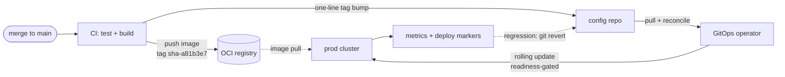

# Enterprise CD — pattern reference

**Date:** 2026-06-12 · **Status: pattern reference — NOT the deployed system.** The running system
is a single DigitalOcean droplet (systemd + rsync), documented in
[`deploy-digitalocean.md`](./deploy-digitalocean.md), operated via
[`../runbooks/operations.md`](../runbooks/operations.md). Cloud-neutral: patterns named, products in
tables. Rationale, mechanics, and worked examples:
[`enterprise-cd-implementation.md`](./enterprise-cd-implementation.md).

Contents: **§1** target CD pipeline · **§2** gap analysis (this app vs. the target) · **§3** full
enterprise additions · **§4** adoption ladder.

## 1. Target pipeline

- Protected main with required checks (the existing `ci.yml` gates) is the only path to production.
- One image build per merge; immutable tag `sha-<gitsha>`. The same digest is promoted through all
  environments — never rebuilt. `latest` is banned in prod: no identity, no rollback target, no
  audit trail.
- No orchestrator watches the registry; an image push deploys nothing. Desired state lives in a
  config repo; an in-cluster GitOps operator reconciles it continuously. **A deploy is a one-line
  tag-bump commit; a rollback is `git revert`.** Cluster credentials never leave the cluster.
- Rolling update: a new ReplicaSet is admitted behind readiness probes; liveness restarts wedged
  pods. A failed rollout means traffic never moved (progress-deadline alert) — not an outage.
- DB migrations run once, as a gated Job before rollout — never at container boot. Old and new pods
  overlap during rollout, so every migration is backward-compatible one release (expand–contract).
- Every deploy is a monitored event: version-labeled metrics, dashboard markers, post-rollout
  error-rate alert.

| Component | Products |
|---|---|
| CI | GitHub Actions, GitLab CI, Jenkins, Buildkite |
| OCI registry | ECR, Artifact Registry, ACR, Harbor, JFrog Artifactory, GHCR, DOCR |
| GitOps operator | Argo CD, Flux |
| Orchestrator | EKS, GKE, AKS, DOKS, OpenShift |
| Secrets | Vault or cloud secret manager, injected via External Secrets Operator / CSI driver |
| Observability | kube-prometheus-stack, managed Prometheus, Datadog; Loki / cloud logging |

## 2. Gap analysis — this app vs. the target

| Area | Today | Target | Adoption trigger |
|---|---|---|---|
| **Database** | SQLite (WAL), single writer process, single-attach block volume (`backend.md` §2.1) | Managed Postgres + pooling; SQLAlchemy/Alembic carry over; SQLite-only listeners deleted (`backend.md` §7.4) | **The blocker.** Needed at >1 instance — and rolling updates run two pods by design, so K8s implies it from day one |
| Migrations | Image CMD: `alembic upgrade head && uvicorn` | Same image, migrate as a gated pre-rollout Job; expand–contract rule in review | Ships with Postgres |
| Secrets | `/srv/app/secrets.env` (0600, hand-placed); fail-closed boot | Secret manager + in-cluster injection; fail-closed boot stays (misconfig crash-loops loudly) | First cluster deploy, or a second operator needing audited access |
| App state | Signed-cookie sessions; the DB is the only state | Already compliant — N replicas need no sticky sessions | None — standing review rule: no new in-process cross-request state |
| Ingress / TLS | Caddy: SPA + same-origin `/api`, auto-ACME, hardened headers + CSP | Ingress controller + cert-manager (or cloud LB). Invariants that must survive: same-origin `/api` (no CORS), HTTPS (WebGPU secure context), CSP HF-host list verified in the pipeline (RB-8) | Cluster deploy |
| Observability | Host Prometheus + Grafana, dashboards/alerts file-provisioned from `infra/monitoring/grafana/` | kube-prometheus; ServiceMonitor scrape; same dashboard JSON via ConfigMaps. Log pipeline keeps the privacy rule: never raw code, `code_hash` only (`backend.md` §10.5) | Cluster deploy |

## 3. Full enterprise additions

- **Environments & promotion** — same digest promoted dev → staging → prod via config-repo PRs;
  ephemeral per-PR preview environments.
- **Progressive delivery** — metric-gated canary with auto-rollback (Argo Rollouts, Flagger);
  blue-green where instant cutback matters more.
- **Supply chain** — image scanning (Trivy, Grype), signing (cosign), SBOM (Syft); admission
  control rejects unsigned/vulnerable images; SLSA provenance levels.
- **Policy-as-code** — Kyverno / OPA Gatekeeper (e.g. reject `:latest`), default-deny
  NetworkPolicies, least-privilege RBAC.
- **DR** — Velero, Postgres PITR, stated RTO/RPO, scheduled restore drills.
- **Compliance & residency** — Japan-region pinning resolves the documented Singapore APPI
  tradeoff; `code_text` classified sensitive; retention windows set.
- **SLOs** — error budgets gate release velocity; every alert links a runbook
  (`docs/runbooks/operations.md` already exists).

## 4. Adoption ladder

| Stage | Adds | Buys | Trigger |
|---|---|---|---|
| **0 — today** | systemd + rsync runbooks (RB-2/RB-3); CI = tests only | $0; fits the single-writer SQLite rule | — |
| **1 — droplet CD** | CI builds + pushes `sha-` image; SSH deploy `docker compose pull && up -d` + health gate; exactly one backend container; SPA built in CI and rsynced | Hands-off deploys, immutable artifacts, rollback identity — at ~$0, no K8s | Manual deploys become friction (earliest: after the evaluation window) |
| **2 — prerequisites** | Managed Postgres, migration-as-Job, secret manager | Replicas become legal — even 2 droplets + LB, still no K8s | A second instance is needed (HA / write contention) |
| **3 — K8s + GitOps** | Config repo, Argo CD/Flux, ingress + cert-manager, kube-prometheus | §1 in full: declarative rollouts, drift control, audit-by-git | Multiple services / people / environments; cost floor rises to control plane + nodes + LB |
