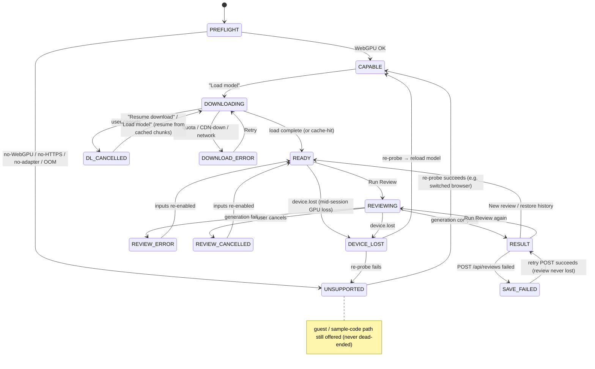

# Frontend Architecture — Code Review Web App

**Date:** 2026-06-08
**Status:** design-complete — canonical frontend architecture.
**Component:** Frontend — a **Vite + React + TypeScript** single-page app running **Qwen2.5-Coder-1.5B**
in the browser via **`@mlc-ai/web-llm`** on **WebGPU**. It owns 100% of inference; the server never runs the
model.
**Companion docs:** [`api-contract.md`](./api-contract.md) — the single, standalone FE↔BE contract this
document **consumes**; [`backend.md`](./backend.md) — the server side; [`deploy-digitalocean.md`](./deploy-digitalocean.md)
— the operational deploy guide; [`README.md`](./README.md) — the architecture index. Neither component doc
restates the contract; both reference it by section (cited as `api-contract.md §N`).

> **Citation convention.** `spec §N` = a section of the locked design spec
> (`../specs/2026-06-08-code-review-app-design.md`). `api-contract.md §N` = a section of the standalone
> contract. "this doc §N" = a section of **this** document.

> **Grounding rule.** This document never contradicts the spec or the contract. It *fills the gaps* the
> spec leaves open (state library, router, editor, markdown renderer, build tooling, component tree,
> version-pin mechanics, CSP) with concrete choices + rationale, and flags genuine uncertainties in §18
> rather than inventing certainty.

---

## 0. Executive summary

The frontend **is** the product's compute. Code review runs entirely in the user's browser: the page
downloads **Qwen2.5-Coder-1.5B** once (~1 GB), then runs every inference on the user's own GPU via
**WebGPU** — there is **no server-side inference path** (spec §2/§3/§9, all *Resolved*). For an enterprise
reader the business consequence is direct: **zero per-user inference cost and no GPU bill** — capacity
scales with users' own hardware rather than a fleet we pay for, and reviewed code stays on the device
during inference.

We make **no privacy claim**: review history and operational telemetry *are* sent to a thin FastAPI backend
(for sign-in, per-user history, and product metrics), disclosed in-app, with a telemetry opt-out and a
history delete. The positioning is "on-device inference," not "your data never leaves your machine"
(spec §1).

The one structural risk is dependence on **WebGPU**, available today on desktop Chrome/Edge and recent
Safari but not everywhere. It is mitigated by an explicit capability **preflight** (with actionable
per-failure guidance), a **guest mode** so a visitor is never forced through OAuth, and one-click
**sample code** so the app is never a dead end (spec §5.2). The rest of this document is the
component-level design behind that thesis.

---

## 1. Overview & responsibilities

The frontend is a **Vite + React + TypeScript single-page app** that owns the entire product experience
**and 100% of inference**. Qwen2.5-Coder-1.5B runs in the browser via WebLLM → WebGPU; the SPA loads the
model, runs reviews, renders results, and only *afterwards* talks to the backend to persist history and
emit telemetry (`api-contract.md §4`). The browser:

1. Probes WebGPU capability and gates the app on it (spec §5.2; this doc §4.3).
2. Downloads + caches the ~1 GB model once, with onboarding UX during the wait (spec §5.6; this doc §10).
3. Runs inference **in-process** via `engine.chat.completions.create(...)` against WebGPU (spec §5.5). The
   mandatory "LLM API" requirement is satisfied by this in-browser call (spec §2).
4. Renders structured Markdown review output **safely** — `react-markdown` + `remark-gfm` +
   `rehype-sanitize`, **no raw `innerHTML` sink** (spec §5.5; this doc §11).
5. Talks to the FastAPI backend **only** for auth, history, feedback, and telemetry — never for inference
   (spec §3; `api-contract.md §4`).

**Security posture of the client.** The frontend **holds no secrets.** There is no LLM API key (local
inference). The OAuth client secret, DB credentials, and session signing key live server-side only
(spec §2/§9). The client carries an anonymous client UUID (`client_id` — lifecycle in §3.2) and a signed
HttpOnly session cookie — nothing else sensitive.

**Responsibilities the frontend owns end-to-end:**

| Responsibility | Spec |
|---|---|
| WebGPU capability probe + blocking modal | §5.2 |
| Model download / cache / progress UX | §5.6 |
| In-browser inference (mode prompts, temp ~0.2, line-numbered input, chunking) | §5.5 |
| Structured, sanitized result rendering | §5.5 |
| Loading lock + cancel during generation | §8 |
| Per-user history UI (restore / delete / empty / save-failed) | §5.1 |
| Latency timing display | §5.3 |
| Feedback widget | §5.4 |
| Standing disclaimers (AI-generated / on-device / data-collected) | §1, §5.5 |
| Bilingual EN/JP UI + review-output language | §5.7 |
| Telemetry beacon to backend | §6.1, §6.4 |
| GitHub OAuth + guest-mode entry points | §5.1, §5.2 |

**Explicitly NOT the frontend's job:** inference hosting (none exists), secret storage, server streaming
(there is no SSE — this doc §5), raw-code analytics (operational telemetry uses `code_hash` + metadata,
never raw code — spec §6.4; raw code travels only into the history DB via `POST /api/reviews`).

---

## 2. Tech stack & key library choices

Every choice is concrete with rationale. Neutral, open-source alternatives are named (no commercial slant).

| Concern | Choice | Pinning | Rationale | Neutral alternatives |
|---|---|---|---|---|
| **Build** | **Vite** | latest 5.x, lockfile-pinned | Spec locks "Vite + React SPA, static build" (§8/§9). Static `dist/` served same-origin by Caddy. | (locked by spec) |
| **Framework** | **React 18 + TypeScript (strict)** | exact in lockfile | Spec locks React. TS strict makes the WebLLM types, message catalogs, and the contract types self-checking and AI-navigable. | Vue/Svelte (locked out) |
| **LLM runtime** | **`@mlc-ai/web-llm`** in a **Web Worker** | **exact `0.2.84`** | Installed as a normal npm dep so the version is lockfile-enforced (spec §5.6 supply-chain) — **not** a CDN `esm.run` import, which is un-lockable and drifts silently. Worker keeps the UI thread responsive during the ~1 GB load + decode (this doc §4.1). | none — single WebGPU LLM runtime |
| **State** | **React built-ins + a few Contexts + TanStack Query for `/api`** | TanStack Query 5.x | See §3. One heavy engine + a handful of REST calls + one primary view → no global store needed. | Redux Toolkit, **Zustand**, Jotai, MobX — overkill here (Zustand explicitly **rejected**) |
| **Routing** | **`react-router-dom` 6.x**, 2 routes | exact | `/preflight`, `/` (workspace). GitHub redirects to the *backend* `/api/auth/github/callback`, which `302`s to `/` on success and `302 → /?auth_error=…` on failure; the SPA reads `?auth_error=` **at `/`** — there is **no SPA `/auth/callback` route** (§8). History is a *panel* in `/`, not a route. | Next.js (locked out — Vite SPA) |
| **Code editor** | **CodeMirror 6** via **`@uiw/react-codemirror`** behind a `CodeInput` abstraction | exact + pinned language packs | See §2.1. `<textarea>` is the guaranteed fallback (the minimum-viable input requirement). | Monaco (rejected — heavy + worker bootstrap), Prism + `contenteditable`, plain `<textarea>` (fallback) |
| **Markdown** | **`react-markdown`** + **`remark-gfm`** + **`rehype-sanitize`** | exact | See §2.2 / §11. Builds a React element tree — **no `dangerouslySetInnerHTML` sink at all** — structurally satisfying the spec §5.5 sanitize mandate. **No DOMPurify dependency.** | `marked` + DOMPurify (reintroduces an `innerHTML` sink) |
| **i18n** | **`react-i18next`** + JSON catalogs (`en`, `ja`) | exact | See §9. Mature, lazy namespaces, pluralization, interpolation; keeps a 3rd locale cheap (spec §5.7). | `lingui`, hand-rolled context map |
| **HTTP** | native **`fetch`** in a typed `apiClient`, driven by TanStack Query | — | Same-origin, cookie auth (`credentials: 'include'`); no axios needed. | axios |
| **Lint/format** | **ESLint** (`typescript-eslint`, `eslint-plugin-react-hooks`, `jsx-a11y`) + **Prettier** | exact | Mandatory (spec §8). Custom rule: **ban `dangerouslySetInnerHTML`** (§11). | — |
| **Package manager** | **pnpm** (lockfile committed) | — | Reproducible installs; npm/yarn acceptable — neutral, no technical edge at this size. | npm, yarn |
| **Test** | **Vitest** + **React Testing Library**; **Playwright** for capability-probe / download e2e | exact | Vitest shares Vite config; Playwright can drive a real WebGPU browser for the gate. | Jest |

**Version pinning (spec §5.6 supply-chain).** The WebLLM version, the model id/URL, and the wasm runtime
URL are pinned to exact versions in a single `config/appConfig.ts` (this doc §4.2). No floating `@latest`.
This module is the **single source of `model_version`** sent to the backend (`api-contract.md §5.3`).

### 2.1 Code editor — CodeMirror 6 behind `CodeInput`, not Monaco

**Decision: CodeMirror 6** (`@uiw/react-codemirror`) as the highlighting editor, exposed through a single
**`CodeInput` abstraction** (`value`, `onChange`, `language`, `readOnly`) implemented by *two* components —
a CodeMirror 6 component and a plain `<textarea>` component. The rest of the app is agnostic to which backs
it, so dropping to a textarea under time pressure is a one-line swap.

- **Why CodeMirror over Monaco:** the page already ships a ~1 GB model — the editor must not compound the
  download budget. CodeMirror 6 is dramatically lighter than Monaco, has tree-shakeable per-language packs,
  needs no web-worker bootstrapping, and has a native **line-number gutter** that aligns with the spec §5.5
  line-numbered-input lever.
- **Minimum-viable floor:** the requirements call for only a *text area*, so the `<textarea>` fallback alone
  satisfies the mandatory bar; CodeMirror is the *exceeds-the-bar* target the spec says to build "if time
  allows, drop to textarea if squeezed" (spec §11 reconciliation).
- **Neutral alternatives named:** Monaco (rich but heavy + worker setup — wrong trade-off against the
  download budget); Prism + `contenteditable` (lighter highlight-only, fiddly caret handling). All
  open-source; no commercial product implied.

### 2.2 Markdown renderer — react-markdown, no DOMPurify

The spec §5.5 sanitize mandate names DOMPurify but no parser. **Decision: satisfy the *intent* (no XSS
sink) more strongly with `react-markdown` + `remark-gfm` + `rehype-sanitize`** — which removes the
`innerHTML` sink entirely rather than patching one after the fact, so **DOMPurify is not a dependency** in
the render path (§11).

- react-markdown builds a **React element tree and never uses `dangerouslySetInnerHTML`** → there is *no
  raw `innerHTML` sink to exploit*. This satisfies spec §5.5 **structurally**, the opposite of a common
  naive pattern — `marked.parse(content) → element.innerHTML` — which is XSS-unsafe and deliberately
  avoided.
- `remark-gfm` gives tables / strikethrough / task lists for the structured `Summary → Issues[severity,
  suggestion]` template.
- `rehype-sanitize` is the **actual sanitizer in the render path** (it runs on every review); default
  schema allows **no raw HTML**, so even if HTML-in-markdown were ever enabled it is stripped.
- A **custom renderer** turns model line-number citations (e.g. `L42` / `lines 12–15`) into clickable
  anchors that scroll/highlight the corresponding line in the editor (spec §5.5 line-numbered citations).

> **DOMPurify note.** DOMPurify is added **only later** if an HTML-emitting sink is ever introduced (e.g.
> an HTML clipboard export or HTML download). With no `innerHTML` sink in the data flow, a
> bundled-but-never-invoked sanitizer is dead weight, not a second layer. See §11.

---

## 3. State management

The spec locks "React SPA" but never names a state solution. **Decision: React Context for cross-cutting
singletons + TanStack Query for `/api` + local `useState`/`useReducer` per feature. No global store**
(Zustand is named only as a *rejected* alternative — §2).

| State | Home | Notes |
|---|---|---|
| Engine **status** (`idle\|loading\|ready\|generating\|error`), load progress, chunk progress | `EngineProvider` (Context) backed by a `useReducer` | The engine **handle** is in a `useRef`, **never in Context value** (§4.1). |
| Locale (`en\|ja`), toggle | `LocaleProvider` (Context) + `localStorage` | Mirrored to the user profile when signed in (§9). |
| Session principal | `AuthProvider` (Context) | `MeResponse` shape from `GET /api/auth/me`; the auth badge branches on `is_guest`. |
| Current review (editor content, mode, locale, streaming buffer, timing, feedback selection, chunk index) | **local `useState`/`useReducer`** per feature | Ephemeral; not server state. |
| Principal fetch, history list/restore/delete, feedback POST, telemetry POST | **TanStack Query** | Cache + optimistic delete + save-failed retry. Its `status` flags map onto the empty / save-failed states (§5.1). |
| UI prefs (language, telemetry opt-out) **and the anonymous `client_id`** | `localStorage` | **History never goes to `localStorage`** — the requirements reject it; history persists to the DB via `/api` (spec §5.1). |

### 3.1 Context surfaces (cross-cutting singletons only)

- **`EngineProvider`** → the WebLLM engine *handle* + inference status. **The engine object itself is held
  in a `useRef`, not in Context value** (§4.1). The Context exposes only `{ status, loadProgress, generate,
  cancel }`.
- **`LocaleProvider`** → current locale (`en` | `ja`), toggle, persisted to `localStorage`.
- **`AuthProvider`** → session user (`{ id, is_guest, display_name, email, ui_language: 'en'|'ja'|null }` |
  `null`, mirroring `MeResponse`; `api-contract.md §5.2`); branches the auth badge on `is_guest`.

**Save flow & the "save-failed" state (spec §5.1).** When a review finishes, the result is shown
immediately from local state; a TanStack mutation then `POST`s it to `/api/reviews`. On success it is
prepended to the history cache. **On failure the result stays visible** with a non-blocking "couldn't save —
retry" affordance — persistence failure never costs the user their review (§5 state machine `SAVE_FAILED`).

### 3.2 `client_id` lifecycle

`client_id` is the anonymous, cross-session correlation id shipped in `POST /api/reviews` and
`POST /api/telemetry` (`api-contract.md §5.3/§5.5`; spec §6.4 session-stitching). It is **generated
client-side with `crypto.randomUUID()` on first visit and persisted to `localStorage`** under a stable key
(`lib/clientId.ts`), read back on every load so it survives reloads and sessions. It is *not* a session
credential (the cookie is the credential) — clearing site data simply mints a new `client_id`, acceptable
for coarse operational correlation. Rationale for client-minted over server-issued: the telemetry beacon
must work *before* and *independent of* auth — the beacon endpoint is **`auth='none'`** (§12;
`api-contract.md §5.5`), so a purely client-minted id keeps the beacon path self-contained.

---

## 4. WebLLM integration (the inference core)

This is the heart of the app and the most security- and performance-sensitive code, isolated behind a small
typed surface.

### 4.1 Engine lifecycle & ownership (worker boundary)

- The MLC engine is created **once** via **`CreateWebWorkerMLCEngine(...)`** (preferred over the
  main-thread `CreateMLCEngine`) so the ~1 GB load + the decode loop run **off the main thread**, keeping
  React at 60fps during download and streaming, rather than the simpler main-thread `CreateMLCEngine`
  (`engine.worker.ts` hosts the MLC engine; the main side talks to it through a typed RPC proxy).
- The engine is owned in a non-rendering hook (`useInferenceEngine`) via **`useRef`**; the hook exposes
  `{ status, loadProgress, generate, cancel }` and an event emitter. **The Context value is only this small
  interface — never the engine object.** Putting a ~1 GB stateful object in render state risks
  re-instantiation / leaks (named risk).
- Lifecycle states drive the §5/§7 state machine: `idle → loading → ready → generating → ready` (+ error
  variants).

```ts
// engineClient.ts — the only inference surface the rest of the app imports
interface EngineClient {
  load(onProgress: (p: LoadProgress) => void): Promise<void>;  // wraps initProgressCallback
  generate(
    messages: ChatMessage[],
    opts: GenOptions,                 // temperature, top_p, …
    onToken: (delta: string) => void, // streamed deltas (§5)
    signal: CancelSignal,             // app-level cooperative cancel (§5)
  ): Promise<GenResult>;              // { text, usage, timing }
  isLoaded(): boolean;
  dispose(): void;
}
```

**Future-seam note (out of build scope).** The spec's §12 designed-but-not-built **server warm-start**
enhancement introduces a client `inferenceMode` flag that would flip `server → on-device` and a status
badge. That is intentionally **out of this frontend's build scope** (this doc builds only the on-device
path; **no `inferenceMode` in the shipped build**). The `EngineProvider` `{ status, generate, cancel }`
interface and the state machine are deliberately shaped so the seam could be added later **without**
restructuring — the flip would occur at the **next review, never mid-stream**, exactly as spec §12
specifies (§18 records this as a non-goal, not an unknown).

### 4.2 Model id + PINNED versions

All three artifacts are pinned in **one typed module** (`config/appConfig.ts`), which **freezes the full
wasm URL string** rather than relying on `webllm.modelLibURLPrefix + webllm.modelVersion`, which silently
drifts the wasm on every package bump (named risk; breaks cache + reproducibility):

```ts
// config/appConfig.ts  — exact pins, no ^ / @latest anywhere
export const WEBLLM_VERSION = "0.2.84";            // also exact in package.json + lockfile
export const MODEL_ID = "Qwen2.5-Coder-1.5B";
export const MODEL_HF_URL =
  "https://huggingface.co/mlc-ai/Qwen2.5-Coder-1.5B-Instruct-q4f32_1-MLC";
// HARD-PINNED wasm (Qwen2 runtime). Do NOT build from modelLibURLPrefix + modelVersion.
export const MODEL_LIB_URL =
  "https://raw.githubusercontent.com/mlc-ai/binary-mlc-llm-libs/<PINNED_SHA>/web-llm-models/<PINNED_VER>/Qwen2-1.5B-Instruct-q4f32_1_cs1k-webgpu.wasm";

export const appConfig = {
  model_list: [{ model: MODEL_HF_URL, model_id: MODEL_ID, model_lib: MODEL_LIB_URL }],
  // cacheBackend chosen for the cache-hit story (§4.4)
};
```

`config/versions.ts` exports `MODEL_VERSION` and `PROMPT_VERSION` constants **stamped onto every history +
telemetry record** (`api-contract.md §5.3`, invariant §6 #3) so the OODA loop and prompt/model A/B analysis
are possible (spec §5.1/§6.2). A "new model available — re-download?" cache-invalidation hook is keyed on
`MODEL_VERSION` (spec §6.3).

> **Lineage / attribution.** Qwen2.5-Coder-1.5B-Instruct is built on the **Qwen2.5** architecture, licensed
> **Apache 2.0**, and packaged for in-browser inference by the MLC team. The WebGPU runtime uses the
> **Qwen2 model-lib** (`Qwen2-1.5B-…-webgpu.wasm`) — the Coder variant reuses the base Qwen2 1.5B
> kernel/tokenizer lib. The chat template (**ChatML**, `<|im_start|>` / `<|im_end|>`) is applied by WebLLM
> from the model artifact config — the app does not set it. No training-data license obligation beyond
> Apache 2.0 applies to this model, so the attribution surface (and license docs) carry a single
> **Apache-2.0** note, not a dual-license one — tracked in the §15 coverage table.

### 4.3 Capability probe (staged, classified) — spec §5.2

A **real probe**, not just `navigator.gpu` (named pitfall: presence ≠ works). `useCapabilityProbe` runs in
stages and classifies each failure into an actionable, localized message:

1. **Secure context:** `if (!window.isSecureContext)` → `NEEDS_HTTPS`. (WebGPU requires HTTPS; on plain
   http other than `localhost`, `navigator.gpu` is unavailable and the model silently can't load.)
2. **WebGPU presence:** `if (!('gpu' in navigator))` → `NO_WEBGPU`.
3. **Adapter:** `const adapter = await navigator.gpu.requestAdapter()` — `null` → `NO_ADAPTER`.
4. **Device:** `const device = await adapter.requestDevice()` (try/catch) — throw → `DEVICE_INIT_FAILED` /
   `OOM` (low-memory / mobile).
5. **Device loss:** on success, register `device.lost.then(info => classify(info))` to catch **mid-session
   device loss / OOM** (handles the Chrome/Edge-update fragility risk).
6. **Secondary check:** also call WebLLM's own GPU-support helper as a cross-check, but keep the manual
   probe for the actionable per-failure messaging the spec requires.

On **any** failure → `<CapabilityGate>` renders the blocking `<UnsupportedModal>` naming **desktop
Chrome/Edge and recent Safari**, explaining *why* (WebGPU required to run the model on-device), plus links
to the **guest / sample-code** path so a visitor is **never dead-ended** (spec §5.2). The probe result
is beaconed (`webgpu_probe`) for the WebGPU-support-rate metric (spec §6.1). A device-class probe
(`deviceClass.ts`) reads coarse GPU vendor / memory / browser from the adapter for telemetry — **never
invasive fingerprinting** (spec §6.4).

### 4.4 Download UX & cache-hit — spec §5.6

- Progress bar + status line driven by WebLLM's `initProgressCallback(report)`:
  `report.progress` (0..1) → bar width, `report.text` → status line. A derived
  `cache_hit` flag rides on `LoadProgress`.
- **Cache-hit detection:** on repeat visits the model is served from the chosen `cacheBackend`
  (CacheStorage / IndexedDB / OPFS — §18.2), surfacing as very fast / low-count progress events → show a
  near-instant "Loaded from cache" state instead of the full download UI. `load_ms` is then ~`0`
  (`api-contract.md §5.3`).
- Storage-quota errors surface from the `CreateWebWorkerMLCEngine` catch (§13).
- The localized **tips carousel** (§10) layers over this overlay with `aria-live="polite"` and
  `prefers-reduced-motion` honored.

### 4.5 Inference call — spec §5.5

`useReviewRun` (via `reviewPipeline`) issues a **fresh** message pair each review (no chat-history
accumulation — a deliberate choice to preserve the ~4k budget for code, rather than the more chat-like
pattern of accumulating `messages[]` across turns):

```ts
const messages = [
  { role: "system", content: promptFor(mode, locale) },     // §5.5 × §5.7 matrix
  { role: "user",   content: withLineNumbers(code) },        // §5.5 line-numbered input
];
const completion = await engine.chat.completions.create({
  stream: true,
  messages,
  stream_options: { include_usage: true },   // → usage + usage.extra timing (§4.7)
  temperature: 0.2,                          // review determinism vs a typical chat default of 0.7 (§5.5)
  // optional 1.5B stabilizers, tuned for code: top_p, repetition_penalty, …
});
for await (const chunk of completion) {
  if (cancelled.current) { await engine.interruptGenerate(); break; }  // cooperative cancel (§5)
  buffer += chunk.choices[0]?.delta?.content ?? "";
  if (chunk.usage) usage = chunk.usage;      // captured on the final chunk
  onUpdate(buffer);                          // paragraph-buffered re-render (§4.9)
}
```

The orchestration steps (in `reviewPipeline.ts`):

1. **Build line-numbered input** — prefix each line with its number so the model cites real lines and the
   UI can anchor citations back (spec §5.5). The numbered text is what gets stored as `code_text`.
2. **Select system prompt** — `prompts/{mode}.{locale}` (mode × locale matrix; spec §5.5/§5.7). Carries the
   `prompt_version`.
3. **Context budget** — estimate tokens against the `ctx4k` runtime. Within budget →
   single-shot; over → `chunker.ts` map/reduce (§4.6).
4. **Generate** — `temperature ≈ 0.2`; no prior turns carried into context.
5. **Assemble** — markdown output + `usage` timing + client-computed `code_hash` → ready for the result
   pane and `POST /api/reviews`.

**Finalized-text source — the accumulated `buffer`, not `getMessage()`.** WebLLM also exposes a
`engine.getMessage()` read-back for finalized assistant text, but the finalized review here **is** the
`buffer` accumulated from the streamed `delta.content`, which is already what `<MarkdownReview>` renders
live. A single source (the buffer) avoids a second read-back path
and any divergence between "what was streamed" and "what gets persisted/displayed." On **cancel** (§5), the
partial `buffer` is what survives. (`getMessage()` remains an available cross-check if a finalize
discrepancy is ever observed; not in the normal path.)

### 4.6 Large-file chunking (map/reduce) — spec §5.5

`chunker.ts` detects input size against the ~4k context budget. For oversized input:

1. **Map:** split by function/section boundary (language-aware heuristics; fall back to fixed-size line
   windows with overlap) → review each chunk independently. `<ChunkProgress>` surfaces *which chunk is in
   progress* ("Reviewing section 2 of 5"). The pipeline owns this loop and emits `{ chunk_index,
   chunk_total }` around each `engineClient.generate(...)` call — each `generate` returns one `GenResult`,
   so the per-chunk indicator is driven by the pipeline, not the engine client.
2. **Reduce (optional synthesis):** a final pass synthesizing the per-chunk findings into one `Summary →
   Issues` document.
3. **Partial-failure handling:** a failed chunk (generation error / device loss) surfaces *that* chunk's
   failure while still rendering the chunks that succeeded — never lose completed work.

Line numbers are preserved per chunk (offset-corrected) so citations still point at real lines in the
original file. (Map/reduce is genuinely complex UI/state — a weekend risk; the single-pass path is the safe
default and chunking is gated behind the size detector — §18.)

### 4.7 Timing display — read WebLLM `usage.extra`, don't hand-roll — spec §5.3

WebLLM computes timing precisely when `stream_options.include_usage: true`. The final chunk's `usage.extra`
carries `time_to_first_token_s`, `decode_tokens_per_s`, `prefill_tokens_per_s`, `time_per_output_token_s`,
`e2e_latency_s`, plus `prompt_tokens` / `completion_tokens` / `total_tokens`. `<TimingBadge>` renders e.g.
**"reviewed in {e2e_latency_s}s · {decode_tokens_per_s} tok/s"** (spec §5.3). **Only model-load time is
measured separately** — wrap the `CreateWebWorkerMLCEngine` await — so everything else comes from the
engine and avoids timer drift (named pitfall).

**`mapUsage()` — engine `usage.extra` (seconds) → wire `timing` object (milliseconds).** The engine reports
**seconds**; the persisted/transmitted `timing` object (`api-contract.md §5.3`; spec §7) uses
**milliseconds** and shorter names. A single `mapUsage()` helper in `lib/telemetry.ts` owns this conversion
so the `<TimingBadge>` display and the telemetry beacon never drift apart, with no scattered s/ms
arithmetic:

| `usage.extra` field (s) | wire field (`timing.*`) | conversion |
|---|---|---|
| `e2e_latency_s` | `total_ms` | `× 1000`, round |
| `time_to_first_token_s` | `ttft_ms` | `× 1000`, round |
| `decode_tokens_per_s` | `tok_per_sec` | pass through (no unit change) |
| `prompt_tokens` | `tokens_prompt` | pass through |
| `completion_tokens` | `tokens_completion` | pass through |
| *(separate)* | `load_ms` | from the wrapped `CreateWebWorkerMLCEngine` await (`performance.now()` ms delta), **not** from `usage.extra`; `0` on a warm/cached engine |

> **Verify + scope:** the exact `usage.extra` key names must be confirmed against the pinned `web-llm@0.2.84`
> build (§18). `prefill_tokens_per_s`, `time_per_output_token_s`, and `total_tokens` are intentionally **not**
> carried to the wire `timing` object (no such fields in `api-contract.md §5.3`; `total_tokens` is derivable).

### 4.8 Mode prompts & structured output — spec §5.5, §5.7

- **Mode selector** (Explain / Find bugs / Security / Style) swaps the *system prompt*; each
  `mode × {en, ja}` is a variant in `config/prompts.ts`. JP variants use a persona tuned for Japanese
  code-review output.
- Output template is fixed: **`Summary → Issues[severity, suggestion]`**, rendered by `<MarkdownReview>`.
  The tight template keeps a 1.5B on-rails and makes rendering trivial (spec §5.5).
- A standing **"AI-generated — verify"** disclaimer frames output as *suggestions*, not authoritative (a
  1.5B invents APIs — spec §5.5 hallucination guardrails).

### 4.9 Streaming re-render strategy

Re-rendering `react-markdown` on **every token** for long reviews janks (named risk). Strategy: **buffer to
paragraph boundaries** (`\n\n`) — re-render only when a paragraph completes; for short reviews per-chunk
re-render is cheap. This caps reconciliation cost without losing the live-streaming feel. The final buffer
is always rendered once more on completion (§11). The paragraph threshold may need tuning (§18.7).

---

## 5. Streaming model — in-browser worker async-iterator, **NO SSE**

Streaming happens **entirely in the browser** — there is no server in the generation loop, so there is
**no SSE and no server streaming endpoint** (spec §2; `api-contract.md §4`).

Flow:

1. `reviewPipeline` calls `engineClient.generate(...)`.
2. Inside the worker, WebLLM yields chunks via its **async iterator**
   (`for await (const chunk of engine.chat.completions.create({ stream: true, stream_options: {
   include_usage: true } }))`) — the same iterator mechanism WebLLM exposes on the main thread, run here
   inside the worker instead.
3. The worker forwards each token delta to the main thread via `postMessage`; `engineClient` invokes
   `onToken(delta)`.
4. The result pane appends the delta and **re-renders sanitized markdown incrementally**, paragraph-buffered
   (§4.9 / §11).
5. **Cancellation is cooperative** (§5.1).
6. On finish, `usage` (from `include_usage`) yields the token counts and `tok/s` for the timing line and
   telemetry (spec §5.3).

> **Where SSE *would* live.** Only if the omitted server-inference / "warm-start" path (spec §10/§12) were
> built. That is explicitly out of scope; the backend doc documents the would-be SSE endpoint so the
> omission is a *decision, not a gap*.

### 5.1 Cancellation — cooperative interrupt + loop break

Cancellation is **cooperative**: on cancel, the worker **calls `engine.interruptGenerate()`** to truly halt
GPU decode **and** breaks the `for await` loop with a guard flag. An app-level cancel signal (a flag / a
`postMessage`) is the main-thread channel that tells the worker to stop. Calling `interruptGenerate()` is a
**deliberate choice** over relying on a loop-break guard alone (an `AbortController` + null-controller
pattern stops iteration but leaves GPU decode running until it naturally yields) — **both layers** (interrupt
+ guard) are kept.

- **`create()` takes no `AbortSignal`** (at the pinned `0.2.84`), so cancellation cannot be a signal passed
  into `create()`; it must be the cooperative interrupt above.
- **Interrupt only on the streaming path.** `interruptGenerate()` in *non-streaming* mode is reported to
  corrupt later calls (**WebLLM issue #447** — verify at `0.2.84`, §18.11); reviews stay on the streaming
  path, so interrupt is safe and we never use it off-stream.
- On cancel, the finalized text is the **accumulated streamed `buffer`** (§4.5), not `getMessage()`.
- Cancel fires on: explicit Stop, navigating away from the review, or starting a new review.

---

## 6. Module / component tree

Feature-sliced, with the inference layer isolated as the architectural core. Each feature folder is a
vertical slice (components + hooks + local state) that depends **downward** on `inference/`, `lib/api`,
providers, `i18n/`, and `ui/` — never sideways on another feature.

```
src/
  main.tsx                      # Vite entry; mounts <App>, providers
  App.tsx                       # Router + provider composition
  config/
    appConfig.ts                # PINNED model id / HF URL / wasm URL / web-llm version (§4.2)
    versions.ts                 # MODEL_VERSION, PROMPT_VERSION (stamped on every record)
    prompts.ts                  # system prompts: {mode × locale} matrix (§5.5, §5.7)
  inference/                    # THE CORE — all WebLLM interaction
    engine.worker.ts            #   Web Worker hosting the MLC engine (CreateWebWorkerMLCEngine handler)
    engineClient.ts             #   typed main-thread RPC proxy to the worker (§4.1)
    reviewPipeline.ts           #   orchestrates one review (prompt → budget → generate → timing)
  providers/
    EngineProvider.tsx          # status + generate()/cancel(); engine handle lives in a useRef (§4.1)
    LocaleProvider.tsx          # en|ja, toggle, localStorage persistence
    AuthProvider.tsx            # session user (MeResponse shape); guest|github via is_guest
    QueryProvider.tsx           # TanStack QueryClient
  hooks/
    useInferenceEngine.ts       # NON-rendering: owns the WebLLM engine (useRef) — §4.1
    useCapabilityProbe.ts       # secure-context → adapter → device → device.lost (§4.3)
    useReviewRun.ts             # builds messages, streams, chunks, captures usage (§4.5–4.7)
    useLocalStoragePref.ts      # tiny typed localStorage hook (lang, telemetry opt-out)
    useTelemetry.ts             # beacon helper (§12)
  lib/
    apiClient.ts                # typed fetch wrapper → /api; RFC 9457 problem+json parsing (§14)
    chunker.ts                  # large-file map/reduce splitter (§4.6)
    lineNumber.ts               # prefix code with line numbers; parse citations
    clientId.ts                 # get-or-create anonymous client_id in localStorage (§3.2)
    telemetry.ts                # build beacon payloads + mapUsage() s→ms (§4.7)
    deviceClass.ts              # coarse GPU/mem/browser from WebGPU adapter (§6.4)
  routes/
    PreflightPage.tsx           # /preflight — capability check + open-in-Chrome guidance
    ReviewWorkspace.tsx         # / — main view (sidebar + editor + result)
    # (no AuthCallback route — OAuth failure lands at /?auth_error=… handled in <AuthBar>; §8)
  components/
    layout/
      AuthBar.tsx               # GitHub sign-in / guest entry / signed-in user
      LanguageToggle.tsx        # EN ⇄ JP
      Disclaimer.tsx            # standing AI-generated / on-device / data-collected notices
    gate/
      CapabilityGate.tsx        # wraps workspace; renders UnsupportedModal on failure
      UnsupportedModal.tsx      # blocking modal: supported browsers + why (§5.2)
    download/
      DownloadOverlay.tsx       # shown during model load (blocks workspace)
      ProgressBar.tsx           # driven by initProgressCallback report.progress
      TipsCarousel.tsx          # rotating localized tips, a11y (§10)
    sidebar/
      Sidebar.tsx
      HistoryList.tsx           # empty / loading / save-failed states (§5.1)
      HistoryItem.tsx           # title+mode+timestamp; click restore; delete
      NewReviewButton.tsx
    editor/
      EditorPane.tsx
      CodeInput.tsx             # CodeMirror 6 | textarea fallback (one abstraction — §2.1)
      ModeSelector.tsx          # Explain / Find bugs / Security / Style
      RunReviewButton.tsx
      SampleCodeButton.tsx      # seeds sample code (one-click for a first-time visitor, §5.2)
    result/
      ResultPane.tsx
      MarkdownReview.tsx        # react-markdown + remark-gfm + rehype-sanitize
      TimingBadge.tsx           # "reviewed in 4.2s · 38 tok/s" (§5.3)
      ChunkProgress.tsx         # which chunk is in progress (map/reduce) (§4.6)
      FeedbackWidget.tsx        # 👍/👎 + reason tags (§5.4)
  i18n/
    index.ts                    # react-i18next init
    en.json
    ja.json
  styles/                       # CSS modules / tokens
  types/
    api.ts                      # contract types (mirrors api-contract.md)
    review.ts                   # ReviewMode, ReviewResult, Timing, Feedback
```

**Component composition (runtime tree):**

```
<App>
  <QueryProvider><AuthProvider><LocaleProvider><EngineProvider>
    <Routes>
      /preflight → <PreflightPage><CapabilityCheck/></PreflightPage>
      /          → <CapabilityGate>            ← blocks on no-WebGPU (UnsupportedModal)
                     <DownloadOverlay/>        ← blocks while model loads
                     <ReviewWorkspace>
                       <AuthBar/> <LanguageToggle/>
                       <Sidebar>
                         <NewReviewButton/>
                         <HistoryList><HistoryItem/>…</HistoryList>
                       </Sidebar>
                       <EditorPane>
                         <CodeInput/> <ModeSelector/> <SampleCodeButton/> <RunReviewButton/>
                       </EditorPane>
                       <ResultPane>
                         <TimingBadge/> <ChunkProgress/>
                         <MarkdownReview/> <FeedbackWidget/> <Disclaimer/>
                       </ResultPane>
                     </ReviewWorkspace>
      (OAuth failure → /?auth_error=… read at /, surfaced in <AuthBar/>)
    </Routes>
  </EngineProvider></LocaleProvider></AuthProvider></QueryProvider>
</App>
```

**Key structural rule:** the WebLLM engine (a ~1 GB stateful object) is owned by the non-rendering
`useInferenceEngine` ref-hook and **never stored in React state or a Context value** — putting it in render
state risks re-instantiation/leaks. Components see only `status` + `generate()`/`cancel()` (§4.1).

---

## 7. Application state machine

A single explicit machine (`useReducer` in `EngineProvider` + a `reviewStatus` per run). The diagram below
renders on GitHub (Mermaid `stateDiagram-v2`); the transition **table** that follows it is the **normative
form** — every From/Trigger/To/UI-effect is explicit, including the states the prose names (`REVIEW_ERROR`,
`SAVE_FAILED`, `DEVICE_LOST`, `DL_CANCELLED`).



**Note on `RESULT` vs `READY`.** `RESULT` is **not** a separate "place"; it is **`READY` with a rendered
review on screen**. The user is fully interactive in `RESULT` (can edit, run again, restore history, give
feedback). It is its own node only because it gates the feedback widget and the save-state transitions
(`SAVE_FAILED`). Treat `RESULT` as a sub-state of `READY`.

**Transition table (normative):**

| From | Trigger | To | UI effect |
|---|---|---|---|
| `PREFLIGHT` | WebGPU probe OK | `CAPABLE` | show "Load model" affordance |
| `PREFLIGHT` | no-WebGPU / no-HTTPS / no-adapter / OOM | `UNSUPPORTED` | blocking `<UnsupportedModal>` + guest/sample path |
| `UNSUPPORTED` | re-probe succeeds | `CAPABLE` | dismiss modal |
| `CAPABLE` | "Load model" | `DOWNLOADING` | `<DownloadOverlay>` + progress + tips |
| `DOWNLOADING` | load complete / cache-hit | `READY` | overlay clears; workspace interactive |
| `DOWNLOADING` | user cancels | `DL_CANCELLED` | overlay shows **"Resume download" / "Load model"** button |
| `DOWNLOADING` | quota / CDN-down / network | `DOWNLOAD_ERROR` | error + **Retry** |
| **`DL_CANCELLED`** | **"Resume download" / "Load model"** | **`DOWNLOADING`** | **re-enters download; partial cached chunks are reused (resume, not full restart)** |
| `DOWNLOAD_ERROR` | Retry | `DOWNLOADING` | re-enter download |
| `READY` | Run Review | `REVIEWING` | lock UI; spinner; Cancel affordance |
| `REVIEWING` | generation complete | `RESULT` | render review; enable feedback (gated on save — §8) |
| `REVIEWING` | generation failure | `REVIEW_ERROR` | localized error; inputs re-enabled; beaconed |
| `REVIEWING` | user cancels | `REVIEW_CANCELLED` | interrupt decode (§5.1); inputs re-enabled |
| `REVIEW_ERROR` / `REVIEW_CANCELLED` | (automatic) | `READY` | back to interactive workspace |
| `RESULT` | `POST /api/reviews` fails (`503`) | `SAVE_FAILED` | sidebar save-failed banner; **review stays rendered**; feedback widget stays disabled (§8) |
| `SAVE_FAILED` | retry POST succeeds | `RESULT` | banner clears; feedback widget enables |
| `RESULT` | New review / restore history | `READY` | clear/replace result pane (no re-inference) |
| `RESULT` | Run Review again | `REVIEWING` | lock UI |
| `READY` / `REVIEWING` | `device.lost` | `DEVICE_LOST` | surface loss; trigger re-probe |
| `DEVICE_LOST` | re-probe → reload | `CAPABLE` | offer model reload |
| `DEVICE_LOST` | re-probe fails | `UNSUPPORTED` | blocking modal |

**Primary happy path:** `PREFLIGHT → CAPABLE → DOWNLOADING → READY → REVIEWING → RESULT` (where `RESULT` =
`READY` with a review on screen).

**Recoverable edge states:** `DL_CANCELLED` (**"Resume download" returns to `DOWNLOADING`, reusing cached
chunks — the user is never stranded**), `DOWNLOAD_ERROR` (quota / CDN-down / network — retryable),
`DEVICE_LOST` (mid-session GPU loss → re-probe), `SAVE_FAILED` (history POST failed — surfaced in the
sidebar, **review still rendered**, feedback gated until save succeeds).

**Input-lock / loading behavior (mandatory, spec §8):**

- On **Run Review** (`REVIEWING`): **disable/lock** the editor, mode selector, language toggle, Run button,
  and history items; show a spinner; expose a **Cancel** affordance.
- Re-enable on `RESULT`, `REVIEW_ERROR`, or `REVIEW_CANCELLED`.
- During `DOWNLOADING`: the whole workspace is behind `<DownloadOverlay>` (the user genuinely cannot
  interact — spec §5.6), with a Cancel for the download itself.
- Wrong-button / unexpected transitions are no-ops or guarded: clicking a history item while `REVIEWING` is
  ignored (or prompts to cancel) — never corrupts the in-flight run (§13).

---

## 8. Data flow & backend interactions

This document **consumes** the standalone contract. It does **not** restate the endpoint tables; for exact
request/response/status, see `api-contract.md`. The endpoints the SPA touches:

| Contract # | Method · Path | Caller | Contract ref |
|---|---|---|---|
| 2 | `GET /api/auth/me` | `AuthProvider` bootstrap | `api-contract.md §4 / §5.2` |
| 3 | `GET /api/auth/github/login` | `<AuthBar>` sign-in | `api-contract.md §5.2` |
| 4 | `GET /api/auth/github/callback` | **backend-handled**; SPA only reads `?auth_error=` at `/` | `api-contract.md §5.2` |
| 5 | `POST /api/auth/guest` | `<AuthBar>` "Continue as guest" | `api-contract.md §5.2` |
| 6 | `PATCH /api/auth/me` | `<LanguageToggle>` (`ui_language`) | `api-contract.md §5.2` |
| 7 | `POST /api/auth/logout` | `<AuthBar>` sign-out | `api-contract.md §5.2` |
| 8 | `GET /api/reviews?limit&cursor` | `<HistoryList>` (keyset) | `api-contract.md §5.3` |
| 9 | `GET /api/reviews/{id}` | `<HistoryItem>` restore | `api-contract.md §5.3` |
| 10 | `POST /api/reviews` | save flow (§3.1) | `api-contract.md §5.3` |
| 11 | `DELETE /api/reviews/{id}` | `<HistoryItem>` delete | `api-contract.md §5.3` |
| 12 | `POST /api/feedback` | `<FeedbackWidget>` | `api-contract.md §5.4` |
| 13 | `POST /api/telemetry` | `telemetry/` (sendBeacon) | `api-contract.md §5.5` |
| 1 | `GET /api/health` | **not** called by the SPA (ops/liveness only) | `api-contract.md §5.1` |

Enums the SPA mirrors (from `api-contract.md §4/§6`): `review_mode ∈ {explain,bugs,security,style}`,
`rating ∈ {up,down}`, `reason_tags ⊆ {inaccurate,too_vague,wrong_language,hallucinated}`. Pre-validate
client-side: `code_text` non-empty and ≤ 256 KB (a soft cap *before* the server's `413`). `timing` field
names/units are produced by `mapUsage()` (§4.7).

**A. Run a review (inference is local; persistence is remote):**

```
user clicks Run
  → lock UI (REVIEWING)
  → build messages {system(mode,locale), user(lineNumbered code)}
  → engine.chat.completions.create(stream) ……… 100% in-browser, no network
  → stream deltas → buffer → <MarkdownReview> (paragraph-buffered)
  → mapUsage(usage.extra) → timing (s→ms, §4.7)
  → render <TimingBadge>, <Disclaimer>, <FeedbackWidget>
  → POST /api/reviews  {code_text, review_output, review_mode, language, model_version,
                        prompt_version, timing, code_hash, client_id, device_class, filename?}
        success (201 ReviewDetail) → prepend to history list (TanStack cache update); id enables feedback
        failure (503)             → SAVE_FAILED banner (review stays on screen; retry available)
  → beacon telemetry (auth='none', fire-and-forget)
```

`code_hash` is computed client-side (SHA-256 of `code_text`); the **server recomputes and verifies it**
(`api-contract.md §5.3`). `model_version` + `prompt_version` are **required** on create. `title` is
**materialized server-side** at write time (= `filename` else the first non-blank line, truncated 120) —
the optional `filename` is sent so the server-computed title matches the user's file (`api-contract.md
§5.3`).

**B. History (per-user, DB-backed — spec §5.1):**

- **List** — `GET /api/reviews?limit&cursor` → **paginated envelope `{items:[…], next_cursor}`** (not a
  bare array). `items.length === 0` **and** `next_cursor === null` → **empty state**; a non-null
  `next_cursor` drives a **"load more"** affordance. The **cursor is a keyset cursor**
  (`base64url("<created_at>|<id>")`, **unsigned/non-secret**) over the composite `(user_id, created_at
  DESC)` index (`api-contract.md §5.3`). List items are **lightweight** (no `code_text`/`review_output`;
  `model_version`/`prompt_version` omitted) — `title · review_mode` is the label.
- **Restore** — click `<HistoryItem>` → `GET /api/reviews/{id}` → hydrate `<ResultPane>` with the stored
  review, **including its embedded `feedback` (`{rating, reason_tags}` | `null`)** so the restored
  `<FeedbackWidget>` shows the correct 👍/👎 state. **No re-inference.** A `404` means not-found **or**
  not-owned (the backend is IDOR-safe — `404`, never `403`).
- **Delete** — `DELETE /api/reviews/{id}` → optimistic removal, rollback on error; `404` is the
  not-owned/not-found outcome.

**C. Feedback (append-only, latest-wins — spec §5.4):** `POST /api/feedback {session_id, rating,
reason_tags[]}` — the review id is carried **in the body as `session_id`** (not in the URL; there is no
`/api/reviews/:id/feedback` path). `session_id` == `ReviewDetail.id` and is **unrelated to the auth-session
cookie** (`api-contract.md §5.4`).

> **Feedback is gated on a successful review save.** `POST /api/feedback` needs a `session_id`, which only
> exists once `POST /api/reviews` returns `201` (that `id` **is** the `session_id`). Therefore:
> - In `RESULT`, `<FeedbackWidget>` is **disabled until the review `id` is available** in the TanStack
>   cache; while the save is in flight it shows a brief "saving…" affordance and enables the moment the
>   `201` lands.
> - In **`SAVE_FAILED`** (review rendered but POST failed, so **no `id` exists**), the widget **stays
>   disabled** with a localized "save to enable feedback" hint, and **re-enables automatically after the
>   save-retry succeeds** (`SAVE_FAILED → RESULT`).
> - **Append-only, latest-wins.** A re-vote (👍→👎 or edited tags) is simply **another `201` POST** with
>   the same `session_id`; the backend **never returns `409`**. There is **no "already rated → update"**
>   path on the client — re-voting just POSTs again and the latest write wins (`api-contract.md §5.4`).

**D. Telemetry beacons (auth='none' — spec §6.1/§6.4):** `POST /api/telemetry` (via
`navigator.sendBeacon`) with a payload matching the contract's `TelemetryBeacon` (Pydantic `extra='forbid'`
→ unknown keys `422`): `{client_id, event, webgpu_supported, device_class, code_hash, metrics:{load_ms?,
ttft_ms?, tok_per_sec?, ok}, error_kind?, browser?, ts?}`. Per-run metrics are **nested under `metrics`**;
the generation-error field is **`error_kind`**; `code_hash` **is sent** (correlation, never raw code);
**`model_version`/`prompt_version` are NOT sent** (they would trip `extra='forbid'`). Keyed by anonymous
`client_id` (§3.2).

> **Telemetry auth is `auth='none'` (public/anonymous beacon).** The endpoint is public, anonymous, and
> FK-decoupled from `User` (`api-contract.md §5.5/§2`): events are stitched only by the anonymous
> `client_id`, and the cookie, if present, is **ignored** on this route. The beacon fires on the **pre-auth /
> never-sign-in** path — e.g. a `webgpu_probe` or `model_load` failure on a visitor who never establishes
> even a guest session — exactly the north-star funnel signal spec §6.1 wants. **The client must NOT call
> `POST /api/auth/guest` just to emit a beacon** — no guest session is established before beaconing. The
> beacon honors the **telemetry opt-out** (localStorage pref) by suppressing all events. Beacon errors
> (incl. dormant `429`) are swallowed client-side; the client cannot read the `202`.

---

## 9. Auth on the client — spec §5.1, §5.2

- **GitHub OAuth (redirect flow) — backend-owned, single `redirect_uri`.** `<AuthBar>` "Sign in with
  GitHub" → navigates to `GET /api/auth/github/login` (the backend builds the authorize URL with the
  client *secret server-side* — the SPA never sees it). **GitHub's registered `redirect_uri` is the backend
  route `/api/auth/github/callback`** — GitHub redirects **straight to the backend**, not to the SPA. The
  backend validates `state`, exchanges `code`, **re-parents any guest history (§9.1)**, sets the session
  cookie, then `302 → /`. The SPA then reads identity via `GET /api/auth/me`.
- **CSRF `state` is entirely backend-owned.** The backend generates `state`, binds it to the pre-auth
  session, and validates it on the callback. `state` is **opaque to the SPA** — the client never
  originates, stores, or verifies it. There is no `sessionStorage` `state` handling on the client.
- **No SPA `/auth/callback` route.** Because GitHub redirects to the backend and the backend `302`s to `/`,
  the SPA only ever sees `/`. On **failure** the backend does **`302 → /?auth_error=<reason>`** (`reason ∈
  {state_mismatch, github_error, db_error}`); the SPA reads `?auth_error=` **at `/`**, renders an inline
  "auth failed — try again / continue as guest" notice in `<AuthBar>`, and strips the param
  (`api-contract.md §5.2`).
- **Session cookie flags — `HttpOnly; Secure; SameSite=Lax` (pinned).** `Lax` is **required, not Strict**:
  the cookie is set on the cross-site redirect back from `github.com`, and `SameSite=Strict` would not be
  sent on that top-level navigation in some browsers — producing the "signed in but appears signed out on
  first load" bug and breaking the very next `GET /api/auth/me`. `SameSite=Strict` would *also* withhold the
  cookie carrying Authlib's OAuth `state`/CSRF nonce on the cross-site callback navigation, so the callback
  never sees the `state` cookie it must compare against and Authlib state validation fails (`state_mismatch`
  → `302 → /?auth_error=state_mismatch`); either way the pin is `SameSite=Lax`. `Lax` *is* sent on top-level
  GET navigations (`api-contract.md §2`). The cookie is **HttpOnly** (JS cannot read it → XSS can't
  exfiltrate the session). Same-origin (Caddy serves SPA + `/api`) → no CORS.
- **Guest / demo mode (spec §5.2).** `<AuthBar>` "Continue as guest" → `POST /api/auth/guest` establishes
  an **isolated guest session** (idempotent on an existing guest cookie) with its own history scope — no
  GitHub grant required, so a visitor is never forced through OAuth. The backend returns a full
  `MeResponse` body (`{id, is_guest:true, display_name:"Guest", email:null, ui_language}`) with status
  **`201`** (new guest row) or **`200`** (reuse / already-authed) — see `api-contract.md §5.2` — so
  `AuthProvider` populates directly from the guest response with no follow-up `GET /api/auth/me`. The
  frontend treats guest and GitHub sessions identically except the auth badge (branches on `is_guest`).
- **Sign-out:** `POST /api/auth/logout` clears the cookie.
- The client holds **no OAuth secret and no LLM key** (spec §2).

### 9.1 Guest → GitHub upgrade — backend re-parents history

On a **guest → GitHub sign-in**, the **backend RE-PARENTS the guest's history to the new authenticated user
in one transaction** — the history **persists** across the upgrade (`api-contract.md §2/§6` invariant #6).
The frontend therefore does **not** discard guest history and makes **no client-side migration call**; after
the callback `302 → /` and `GET /api/auth/me`, the (re-parented) history simply appears under the GitHub
identity. On a re-parent failure the login surfaces `db_error` (`302 → /?auth_error=db_error`) and the guest
data is left intact. The frontend **must not** assume guest history is discarded.

---

## 10. Download experience — spec §5.6

The ~1 GB first load is the make-or-break first impression and the one moment the user truly cannot
interact, so it doubles as onboarding. *(This is precisely the friction the spec §12 server warm-start is
designed to remove for enterprise deployments — out of this frontend's build scope; the `inferenceMode`
seam in §4.1 keeps that future option open.)*

- **Progress:** `<ProgressBar>` driven by WebLLM's `initProgressCallback` `report.progress`; status line
  from `report.text`. **Cache-hit** → near-instant "Loaded from cache" (§4.4).
  Retry/Cancel buttons; storage-quota and CDN errors surfaced (§13).
- **Rotating tips carousel (`<TipsCarousel>`):** localized `{icon, title, body}` items, ~5s time-based
  rotation, gentle fade, looping. **Tip set (EN/JP)**, doubling as on-device reinforcement: *Runs on
  your device — no API keys, no usage limits · EN/JP switch (bilingual review output) · Sign in to sync
  history · Review modes · Offline after download · Feedback tunes the model · Speed depends on your GPU.*
  Tone: genuine hints, **never nags/upsells**.
- **Accessibility (mandatory, spec §5.6):**
  - Carousel region has **`aria-live="polite"`** so screen readers announce tip changes without
    interrupting.
  - **`prefers-reduced-motion`** honored — when set, **disable the auto-rotation + fade**; present tips
    statically (or only advance on user action).
  - **Optional dot controls** for manual navigation; each dot is a labeled button; the progress bar exposes
    `role="progressbar"` with `aria-valuenow/min/max`.

---

## 11. Rendering & security

- **Safe rendering (the central XSS guard).** Review Markdown is rendered with **`react-markdown` (no
  `dangerouslySetInnerHTML` sink at all)** + **`remark-gfm`** + **`rehype-sanitize`** (§2.2). The guarantee
  is **structural + enforced**: (1) react-markdown builds a React element tree with no `innerHTML` sink;
  (2) `rehype-sanitize` **runs in the actual render path** on the model output (default schema strips raw
  HTML — invoked on every review); (3) an **ESLint rule bans `dangerouslySetInnerHTML`** so no future code
  can reintroduce a sink. A common naive pattern — **`marked.parse(content) → element.innerHTML`** —
  is **XSS-unsafe and deliberately avoided** — reviewed code + 1.5B output is an
  injection vector.
  - **DOMPurify note:** **not** added as a dependency. With no `innerHTML` sink in the data flow, a
    bundled-but-never-invoked sanitizer is dead weight, not a second layer — `rehype-sanitize` is the
    sanitizer that actually executes. **DOMPurify is added only later** if an HTML-emitting sink is ever
    introduced (e.g. an HTML clipboard export / download), **wired into that specific sink**, with the path
    documented at that time.
- **Incremental streaming re-renders** go through the same sanitizer, paragraph-buffered (§4.9), and run
  once more on the final buffer.
- **Line anchoring:** citations reference the provided line numbers; the renderer links them to the
  numbered input rather than trusting model-invented locations (spec §5.5).
- **No client secrets:** no LLM key (local inference), no OAuth client secret, no DB creds (spec §2). The
  only client-held credential is the **HttpOnly** session cookie.
- **CSP (served by Caddy, §16)** — restrictive `Content-Security-Policy`:
  - **`script-src 'self' 'wasm-unsafe-eval'`** — **`'wasm-unsafe-eval'` is mandatory, not optional.** In
    Chromium, `WebAssembly.compile/instantiate/instantiateStreaming` is governed by `script-src`; under
    bare `script-src 'self'` (without `'wasm-unsafe-eval'` or the broader `'unsafe-eval'`) **WASM
    instantiation is blocked** and WebLLM's entire on-device runtime — the whole point of the app —
    silently fails to start. `'wasm-unsafe-eval'` is the narrow allowance that permits WASM **without**
    allowing JS `eval`. Verify on the real target browsers against the pinned `0.2.84` worker (§18.1).
  - **`connect-src`** — **must include the origins that actually serve the model-weight bytes, which are
    *not* `huggingface.co` directly.** HuggingFace resolves the resolve URL and then **302-redirects the
    large weight shards (~1 GB) to a separate LFS/CAS host** (historically `cdn-lfs.huggingface.co`;
    currently Xet/CAS hosts such as `cas-bridge.xethub.hf.co` / `*.hf.co`). A fetch redirected to a host
    absent from `connect-src` is **CSP-blocked** — the resolve succeeds but the byte fetch is denied, and
    this passes silently in dev where CSP is often absent. The directive must enumerate the **real redirect
    target(s)**, e.g. `connect-src 'self' https://huggingface.co https://*.hf.co
    https://cas-bridge.xethub.hf.co https://cdn-lfs.huggingface.co https://raw.githubusercontent.com`
    (model resolve + redirected weight bytes + pinned wasm). **The exact host set must be pinned to the
    narrowest list that actually serves the bytes, determined by a live fetch of the pinned model URL and
    inspecting the `Location` header(s)** (§18.1) — so the CSP is validated against the real network path,
    not the catalog URL. Pinning these origins also doubles as supply-chain narrowing.
  - `worker-src 'self' blob:` (the WebLLM worker may be constructed from a blob; confirm the worker's own
    WASM instantiation inherits `script-src` under the pinned version — §18.1);
  - `img-src 'self' data:`; `object-src 'none'`; `frame-ancestors 'none'`.
- **HTTPS mandatory:** WebGPU secure-context + mixed-content rules require it; Caddy provides auto-TLS
  (spec §9).
- **Cross-origin isolation (if needed):** if the WebLLM worker/wasm requires `SharedArrayBuffer`, serve
  `COOP: same-origin` + `COEP: require-corp` from Caddy and confirm the model/wasm assets carry the right
  CORP/CORS headers; otherwise omit to avoid breaking other resources (§18.3).
- **Disclosure, not privacy claim:** the standing `<Disclaimer>` makes **no "data never leaves your device"
  claim** — history + telemetry are sent to the backend, disclosed in-app (spec §1/§6.4), with a
  **telemetry opt-out** and **history delete**.
- **Standing disclaimers:** persistent "AI-generated — verify"; output framed as *suggestions*, not
  authoritative (1.5B hallucinates / invents APIs — spec §5.5).

---

## 12. Telemetry (client) — spec §6.1, §6.4

- `telemetry/` collects events (`model_load`, `webgpu_probe`, `generation`/`error`, `funnel_stage`) and
  flushes them via **`navigator.sendBeacon`** to `POST /api/telemetry` (**`auth='none'`** —
  `api-contract.md §5.5`).
- **Anonymous `client_id`** (persisted UUID, §3.2) stitches pre-login sessions; logged-in users also have a
  real id (spec §6.4). **No device fingerprinting** (spec §6.4).
- **`device_class`:** coarse GPU vendor (from the WebGPU adapter) + memory bucket + browser — for the perf
  story (spec §6.4).
- **Hard rule:** telemetry carries **metadata + `code_hash` only, never raw code** (`api-contract.md §5.5`,
  invariant §6 #2). A unit test asserts no event payload contains code text.
- **No guest session just to beacon:** the client **must not** call `POST /api/auth/guest` to emit a
  telemetry event — the beacon is `auth='none'` and fires on the pre-sign-in path with no cookie (§8.D).
- **Opt-out:** when `telemetry_opt_out` (localStorage pref) is set, the collector is a no-op.

---

## 13. Error handling & edge cases

**Error body — RFC 9457 `application/problem+json`.** Every non-`2xx` from the backend carries an RFC 9457
problem document (`api-contract.md §3`). `apiClient` (`lib/apiClient.ts`) **parses that body and surfaces
`detail` + `correlation_id`** (the latter for bug reports) in the localized error UI; the **`status`**
drives the state-machine transition (e.g. `503 → SAVE_FAILED`). User-facing copy is localized by the error
class (EN/JP, §14); `detail` is a developer aid.

**Error-code taxonomy.** `apiClient` maps each contract status to a localized message + recovery action;
the same taxonomy covers client-only errors that never reach the server:

| Source | Status / class | UI treatment |
|---|---|---|
| Server | `401` not-authenticated | redirect to sign-in / offer guest mode |
| Server | `422` validation, `413` payload-too-large | inline message at the input |
| Server | `404` review not-found/not-owned (IDOR-safe) | drop the stale item from the history cache |
| Server | `429` rate-limited (dormant), `500` internal | non-blocking toast + retry |
| Server | `503` DB write failure | `SAVE_FAILED` — review stays rendered + retry |
| Client | capability (`no_webgpu` / `no_adapter` / `device_lost` / `oom` / `insecure_context`) | blocking modal (§4.3) |
| Client | model-load / generation / save / network | classified toast + retry (§7/§10) |

**Edge cases:**

| Edge case | Frontend handling |
|---|---|
| **WebGPU unsupported** (no-WebGPU / no-HTTPS / no-adapter / OOM / device-lost) | Staged probe (§4.3) classifies → blocking `<UnsupportedModal>` with the specific reason + supported browsers + guest/sample path. Never a dead end (spec §5.2). |
| **Empty input** | Run Review disabled until non-whitespace code present; inline hint; no engine call. |
| **Oversized input** | Client soft cap before the server's `413`; size detector → chunking map/reduce (§4.6) with `<ChunkProgress>`; partial-failure tolerant. |
| **Cancel mid-generation** | Cooperative: `engine.interruptGenerate()` truly halts GPU decode **and** the for-await loop breaks on a guard flag (§5.1). `create()` takes no `AbortSignal`; interrupt **only** on the streaming path (WebLLM issue #447 caveat — verify at `0.2.84`, §18.11). On cancel the finalized text is the accumulated `buffer`, not `getMessage()`. Re-enable inputs → `READY`. |
| **Wrong-button / unexpected transition** | State-machine guards (§7): clicking history or mode-switch during `REVIEWING` is ignored or prompts to cancel; the Run button is locked during generation; restoring history never re-fires inference. |
| **Model CDN (HuggingFace) down** | Download fails → `<DownloadOverlay>` shows a CDN-unreachable message + Retry; surfaced in telemetry (feeds the spec §6.1 CDN status banner). No silent hang. |
| **Storage-quota exceeded** | Caught from engine init → actionable message ("free up disk / clear site data") + Retry. |
| **Device lost mid-session** | `device.lost` handler → `DEVICE_LOST` → re-probe; reload the model or fall to `UNSUPPORTED`. |
| **History save failed (`503`)** | `SAVE_FAILED` banner in sidebar; the rendered review is **not** lost; Retry persists it (spec §5.1). Feedback stays disabled until the save retry succeeds (§8). |
| **Generation error** | `REVIEW_ERROR` with the engine error message; inputs re-enabled; beaconed. |
| **Rate-limited (`429`)** | On the abuse-surface endpoints (`POST /api/reviews`, `POST /api/telemetry`, the auth routes) the backend *may* return `429`. Client shows a localized **retry-after** notice; the review stays on screen (same posture as `SAVE_FAILED`); telemetry beacons are dropped. **Currently dormant** — enforcement is a server-side no-op (spec §10), so this path is *defined but not exercised*; it exists so the promised "one-line switch later" surfaces as a handled notice, not an unhandled error. |
| **OAuth pop-up blockers** | **Not a failure mode:** GitHub OAuth uses a **full-page top-level redirect** (§9), not a `window.open` pop-up, so pop-up blockers cannot interfere. The app opens no auxiliary windows/tabs in any mandatory flow. |

All user-facing messages are localized (§14). **No `console.error`-only failures** — every failure surfaces
a localized, actionable UI message (mandatory error handling, EN/JP briefs).

---

## 14. i18n architecture — spec §5.7

- **UI strings:** `react-i18next` with JSON catalogs `i18n/en.json` + `i18n/ja.json` covering *all*
  interface strings, disclaimers, tips, history UI, and error/edge messages. Keys are namespaced (`gate.*`,
  `download.*`, `review.*`, `history.*`, `errors.*`) so a third locale stays cheap (spec §5.7).
- **Language toggle:** `<LanguageToggle>` flips locale; persisted to `localStorage` (immediate) **and** to
  the user profile via `PATCH /api/auth/me {ui_language:"en"|"ja"}` when signed in (the profile field is
  **`ui_language`** — the UI-locale toggle, distinct from `ReviewSession.language` which is the review
  *content* language; `api-contract.md §2`).
- **Review-output language follows the locale:** the review system prompt picks the EN or JP variant
  (§4.8). **Running a fluent Japanese code review is the bilingual showcase** the app is built to
  demonstrate (spec §5.7).
- **IME safety (Japanese input):** guard Enter-to-run on `isComposing` (via `compositionstart` /
  `compositionend`) so committing a Japanese IME candidate with Enter never fires a review. Implement a
  **single** composition-aware Enter handler — a common bug is attaching this guard twice (once per
  listener), where the second attachment silently drops the `shiftKey` guard.
- **Risk acknowledged:** full EN/JP catalogs are real work (every string × 2); incomplete catalogs would
  undercut the bilingual promise — catalog completeness is a tracked deliverable, not an afterthought.

---

## 15. Mandatory-requirements coverage

| Requirement | Frontend coverage | Where |
|---|---|---|
| Code input (textarea or highlighting editor) | CodeMirror 6 editor behind `CodeInput`; `<textarea>` fallback (the minimum-viable input requirement) | §2.1, `CodeInput` |
| "Run Review" button | `<RunReviewButton>` | §6 |
| Result display (scrollable / formatted) | `<ResultPane>` + `<MarkdownReview>` (sanitized Markdown) | §2.2, §4.8 |
| Chat history (per-user, DB) | Sidebar `<HistoryList>`; persisted via `/api`, not localStorage | §5.1, §8 |
| Status display + lock UI | Spinner + disable editor/mode/run/history during `REVIEWING` | §7 |
| LLM request submission | `engine.chat.completions.create(...)` in-browser | §4.5 |
| Response handling/format | Structured `Summary → Issues[severity, suggestion]` render | §4.8 |
| Error handling | Classified WebGPU / load / generation / save errors, all localized | §13 |
| Security / "API key mgmt" | No client secrets; backend holds secrets; safe rendering; CSP | §2, §11 |
| User auth (per-user history) | GitHub OAuth + guest mode | §9 |
| Edge cases (wrong-button, bad input, pop-ups) | Full table; **pop-ups explicitly addressed** — OAuth is a full-page redirect, not a pop-up window, so pop-up blockers are not a failure mode (row in §13) | §13 |
| Linter/formatter | ESLint + Prettier (+ banned `dangerouslySetInnerHTML`) | §2, §11 |
| **License attribution (mandatory)** | Shipped UI **MUST** surface the model license: **Apache-2.0** (Qwen2.5-Coder-1.5B-Instruct, packaged for in-browser inference by the MLC team). Appears in the in-app attribution surface (`<Disclaimer>` / about panel) and the license docs — and must say **Qwen2 base** | §4.2, §11 |
| **Bilingual EN/JP (exceeds the bar)** | Full UI i18n + EN/JP review output | §14 |

---

## 16. Build, deploy & testing — spec §9

- **Build:** `vite build` → static `dist/` (HTML/JS/CSS + the small app bundle). The ~1 GB model is **not**
  bundled — it streams from HuggingFace at runtime and caches client-side (§4.4). pnpm lockfile committed;
  exact pins for `@mlc-ai/web-llm@0.2.84` and the wasm URL (§4.2).
- **Serve (same-origin, no CORS):** **Caddy** serves `dist/` same-origin on a single **DigitalOcean
  Droplet** (a plain Ubuntu VM) in **`sgp1` (Singapore)** and reverse-proxies `/api/*` → `127.0.0.1:8000`
  (uvicorn/FastAPI). One origin → no CORS, one cert, one deploy (spec §9). Caddy provides automatic Let's
  Encrypt TLS (HTTPS mandatory for WebGPU secure-context). A **Droplet** (not App Platform) is required
  because the backend's single-writer SQLite WAL needs a **persistent block volume** — App Platform's
  ephemeral container disk would break it. DO has **no Japan region**, so `sgp1` adds some RTT vs a Tokyo
  host; this is **acceptable because inference is fully client-side**, so only thin auth/history/telemetry
  calls traverse the backend and the latency hit on the user-facing review path is negligible for
  users in Japan. The full operational walkthrough (Droplet · Block Storage Volume ·
  Reserved IP · Cloud Firewall · the AWS↔DO product mapping) lives in
  [`deploy-digitalocean.md`](./deploy-digitalocean.md). *(**AWS EC2** in `ap-northeast-1` (Tokyo) remains an
  equivalent alternative on the identical Caddy + systemd + uvicorn + SQLite stack.)*
- **Asset headers (Caddy):** long-cache immutable hashed JS/CSS; correct **`application/wasm` MIME** for
  the WebLLM wasm; the CSP + (optional) COOP/COEP headers from §11. `index.html` no-store so deploys take
  effect.
- **Single SQLite *writer process* (load-bearing backend constraint — affects the SPA's writes).** The
  spec's "SQLite single-writer / single instance" (spec §9) is only satisfied if uvicorn runs as
  **a single OS process (no `--workers`)**. Multiple workers each open the same SQLite file as *independent*
  writers; WAL improves reader/writer concurrency but still allows **one writer at a time**, so concurrent
  writers produce `database is locked` (`SQLITE_BUSY`) — surfacing client-side as **intermittent `503` →
  `SAVE_FAILED`** on `POST /api/reviews` and `POST /api/feedback`. The backend must run a single process (no `--workers`) or
  route writes through a single serialized writer (`PRAGMA busy_timeout` + WAL). FE↔BE coordination item
  (§18.10).
- **Model-asset cache / versioning:** weights cache in the browser keyed by model id; a new model
  version bumps `MODEL_VERSION` (§4.2) → triggers the "new model available — re-download?" UX (spec §6.3).
  The pinned wasm URL guarantees a package bump can't silently change cached bytes.
- **Reproducibility:** no floating `@latest`; the three pins (web-llm version, HF model URL, wasm URL) make
  the client byte-reproducible (spec §5.6 supply-chain).
- **Lint/format:** ESLint + Prettier (+ banned `dangerouslySetInnerHTML`) — spec §8.
- **Testing (Vitest + RTL; Playwright for e2e):** `engineClient` RPC contract (mock worker),
  `reviewPipeline` chunking + prompt selection, **`mapUsage()` s→ms** conversion, **`rehype-sanitize`** XSS
  fixtures, the **capability classifier**, the **no-raw-code telemetry invariant**, the **save-failed
  flow**, and the **IME composition** guard. Playwright drives a real WebGPU browser for the capability gate
  and the download/cache-hit path.

---

## 17. Backend contract (consumed)

**The frontend consumes the contract defined in [`api-contract.md`](./api-contract.md); the wire shapes
(methods, paths, request/response DTOs, status codes, auth requirements, enums) are not restated here.**
`api-contract.md` is the single source of truth for the HTTP boundary; this document references it and must
not re-declare shapes. Where this document needs to talk about a call, it cites the contract by endpoint
number (`api-contract.md §4` endpoint summary) and per-endpoint detail (`§5`).

Frontend-side behavior layered on top of that contract (not part of the wire shape):

- **`apiClient` (`lib/apiClient.ts`)** is a typed `fetch` wrapper sending `credentials: 'include'`; the
  typed DTOs in `types/api.ts` mirror the contract's DTOs — **`MeResponse`, `ReviewCreate`,
  `ReviewListItem`, `ReviewListPage`, `ReviewDetail`, `FeedbackCreate`, `FeedbackResponse`,
  `TelemetryBeacon`**.
- **Error bodies** are RFC 9457 `application/problem+json` (`api-contract.md §3`). `apiClient` parses each
  non-`2xx` body and surfaces `detail` + `correlation_id` in the localized error UI, while the status code
  drives the state-machine transition (e.g. `503 → SAVE_FAILED`).
- **`mapUsage()` (`lib/telemetry.ts`)** produces the `timing.*` field names/units on `POST /api/reviews`
  from the engine's `usage.extra` seconds — see §4.7.
- **Rate limiting (`429`)** is scaffolded as a server-side no-op today (`api-contract.md §3`, spec §10); the
  client path exists (§13 "Rate-limited (429)") so enabling enforcement later surfaces a handled notice, not
  an unhandled error.
- **Telemetry is `auth='none'`** (`api-contract.md §5.5`) — beaconed pre-sign-in, no cookie required; the
  client never establishes a guest session just to beacon (§8.D / §12).

---

## 18. Open questions (genuine uncertainties — flagged, not invented)

1. **Exact pinned wasm path (`<PINNED_SHA>`/`<PINNED_VER>` in §4.2).** The concrete commit-pinned
   `raw.githubusercontent.com` URL for the `Qwen2-1.5B-…_cs1k-webgpu.wasm` that is binary-compatible
   with `@mlc-ai/web-llm@0.2.84` must be **verified against a live load** before locking — a wasm/runtime
   mismatch fails silently. **This load-test must also validate the CSP against the real network path:**
   - **Real weight-host discovery** — a **live fetch of the pinned `MODEL_HF_URL`**, inspecting the
     `Location` header(s) of the 302(s) to find the host(s) that actually serve the ~1 GB weight bytes (an
     LFS/CAS host such as `*.hf.co` / `cas-bridge.xethub.hf.co` / `cdn-lfs.huggingface.co`, **not**
     `huggingface.co`). Pin `connect-src` to the **narrowest** observed set (§11).
   - **WASM under CSP** — confirm `0.2.84` instantiates its WASM under `script-src 'self'
     'wasm-unsafe-eval'` on Chrome/Edge desktop, and the blob-constructed worker inherits the directive
     (`worker-src 'self' blob:` sufficient).
2. **`cacheBackend` choice** (CacheStorage vs IndexedDB vs OPFS) — affects cache-hit reliability + quota
   across Chrome/Edge/Safari. Default to whichever WebLLM recommends for the pinned version (§4.4).
3. **Cross-origin isolation (COOP/COEP)** — only if the pinned worker needs `SharedArrayBuffer`; enabling
   can break unrelated cross-origin resources. Confirm before adding (§11).
4. **Web-worker engine vs main-thread** — `CreateWebWorkerMLCEngine` is preferred (§4.1) but adds Vite
   worker-bundling complexity; the main-thread `CreateMLCEngine` is the documented fallback at the cost of
   some main-thread jank.
5. **1.5B sampling stabilizers for *code*** — `repetition_penalty`/`frequency_penalty`/`logit_bias`
   (typically tuned for chat) need empirical tuning at `temperature 0.2` for deterministic code
   review (§4.5).
6. **Editor vs textarea final call** — CodeMirror 6 is the target behind `CodeInput`; the `<textarea>`
   fallback stays first-class if time-squeezed (build-time decision, not a design unknown).
7. **Streaming markdown buffering threshold** — paragraph-boundary buffering is the plan (§4.9); the
   precise threshold (paragraph vs sentence vs token-count) may need tuning for short, choppy reviews.
8. **History title derivation** — **resolved in the contract:** `title` is **materialized server-side** at
   write time (= `filename` else first non-blank line, truncated 120; `api-contract.md §5.3`). The client
   sends the optional `filename` so the server title matches the user's file; the client does not own the
   title.
9. **OAuth failure-redirect shape (FE↔BE coordination).** The FE expects `302 → /?auth_error=…` (handled at
   `/`) and has **dropped** the thin `/auth/callback` error route (§9). If the backend is instead coordinated
   to redirect failures to `/auth/callback?error=`, re-add that route; the registered `redirect_uri` name
   `/api/auth/github/callback` is unaffected either way. The session cookie's `HttpOnly; Secure;
   SameSite=Lax` attributes must match on both sides.
10. **SQLite single *writer process*** — confirm the backend runs uvicorn as a single process (no `--workers`, or serializes
    writes); multi-worker `SQLITE_BUSY` surfaces as intermittent `503`/`SAVE_FAILED` on review/feedback
    writes (§16). FE↔BE coordination item.
11. **`interruptGenerate()` non-streaming corruption at `0.2.84`** — the "WebLLM issue #447" claim
    (interrupt corrupting later *non-streaming* calls) was filed against an earlier version; **confirm it
    still holds at the pinned `0.2.84`**. The design only ever interrupts on the streaming path (§5.1), so
    this is a verification item, not a blocker.
12. **Warm-start / `inferenceMode` seam — explicitly out of scope (non-goal, not an unknown).** The spec
    §12 server warm-start (server→on-device handoff) is **intentionally not built**. Recorded only to state
    the constraint: the `EngineProvider` + state machine must **not foreclose** a future `inferenceMode`
    seam (next-review flip, never mid-stream; status badge server→on-device — §4.1). No build action for
    v1.

---

## 18b. Workspace shell & performance invariants (as-built addendum, 2026-06-11)

The 2026-06-10/11 UI sessions added a workspace shell on top of §6/§7. Four of its properties are
**load-bearing** — they were each discovered/confirmed the hard way and are easy to regress
silently:

1. **The ambient creature canvas must never run at full rate while the model owns the GPU.**
   Empirically confirmed on Apple Silicon: the full-viewport 60 fps canvas repaint (raster +
   composite share the GPU and unified-memory bandwidth with WebGPU inference) measurably cut
   tok/s. `OctopusBackground` has a `calm` prop — steps/paints every 4th frame at 1× DPR (~6% of the
   raster cost; the creature drifts in slow motion, a hard freeze was rejected as UX) — and
   `ReviewWorkspace` wires it to `REVIEWING || DOWNLOAD_STATES`. Any new ambient animation must
   follow the same rule (the hero→split transition is CSS-only and one-shot, which is fine).

2. **Never wire `onToken` straight to React state.** Every flush re-parses the entire markdown
   buffer (react-markdown + rehype-sanitize), so per-token flushing is O(n²) main-thread work that
   scales with tok/s. `ReviewWorkspace.onRun` goes through `lib/throttle.ts` (`throttleLatest`,
   10 Hz, leading + latest-value trailing); on cancel/error the pending partial is flushed, on
   success the trailing timer is cancelled *before* the authoritative final output lands.

3. **`WelcomeHero` is one persistent layout, not two swapped branches.** Hero (centered card) and
   split (full-height panels) are the same animated CSS grid — idle `1fr 0px 0fr`, split
   `Nfr 1px (100-N)fr` set inline from the persisted split percentage (`tako.split.left`,
   clamped 30–70). Two consequences: the editor **never remounts** across the transition
   (CodeMirror state survives a run), and the morph animation depends on **track-count and
   track-type parity** between the two templates — adding/removing a grid child or changing a
   track's unit breaks the interpolation back to a hard snap.

4. **Two features pattern-match web-llm's English progress strings** and will silently degrade
   (tests catch it) on a web-llm upgrade that rewords them: the download card's
   Loading-vs-Downloading title keys off `/loading model from cache/i`, and the status line strips
   the redundant `"NN% completed, N secs elapsed…"` tail. Related known tradeoff: the cleaned raw
   status line is shown even though it is English-only telemetry (all surrounding copy is
   localized) — a deliberate reversal of the review-wave decision to drop it, recorded in
   `DownloadOverlay.tsx`.

Smaller shell notes: `WorkspaceHeader`'s status dot derives from the engine machine (green =
workspace states, amber = REVIEWING, gray otherwise); the editor's `panel` variant derives its
file-tab name via `reviewMeta.fileNameFrom` (same derivation as history titles); the Run-Review
creature burst is decoupled via a `tako:burst` window event (`src/creatures/burst.ts`) so the canvas and
the editor stay ignorant of each other; `DownloadOverlay` is a **non-modal named region** (no
focus trap — a multi-minute screen must not strand keyboard/SR users) with a `ready` mirror-card
state so Load-model → Downloading morphs in place.

---

## 19. Cross-references

- **HTTP boundary (single source of truth):** [`api-contract.md`](./api-contract.md) — consumed, not
  restated.
- **Server side:** [`backend.md`](./backend.md).
- **Deploy:** [`deploy-digitalocean.md`](./deploy-digitalocean.md) — Droplet · Block Storage Volume ·
  Reserved IP · Cloud Firewall · `sgp1`/Singapore; carries the AWS↔DO mapping (AWS EC2/Tokyo remains an
  equivalent alternative).
- **Architecture index:** [`README.md`](./README.md).
- **Product decisions:** [`../specs/2026-06-08-code-review-app-design.md`](../specs/2026-06-08-code-review-app-design.md)
  (spec §5 build scope, §6 design scope).
